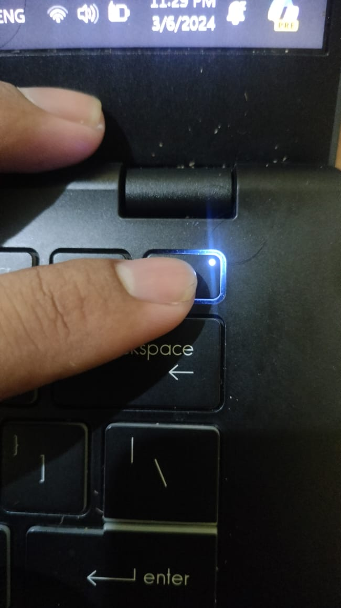
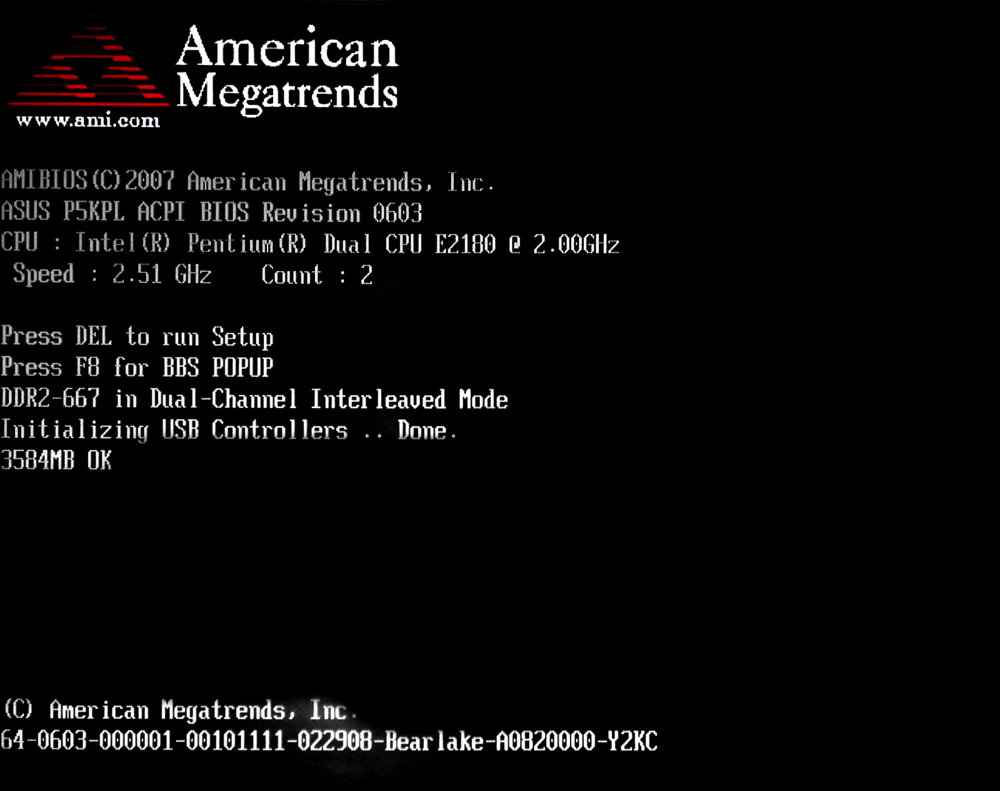
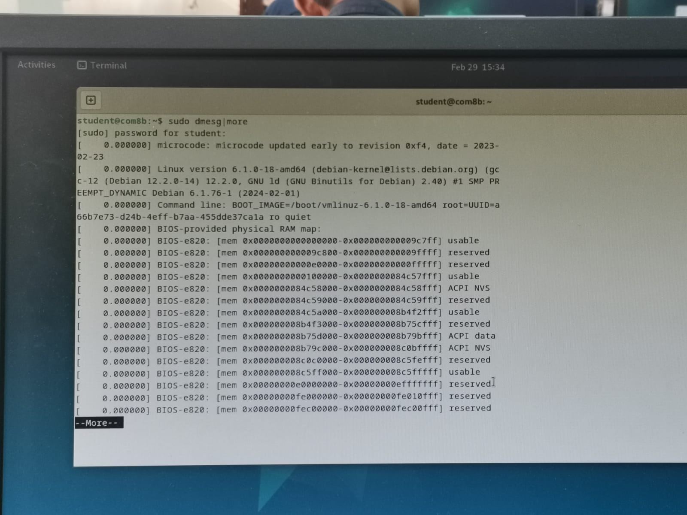
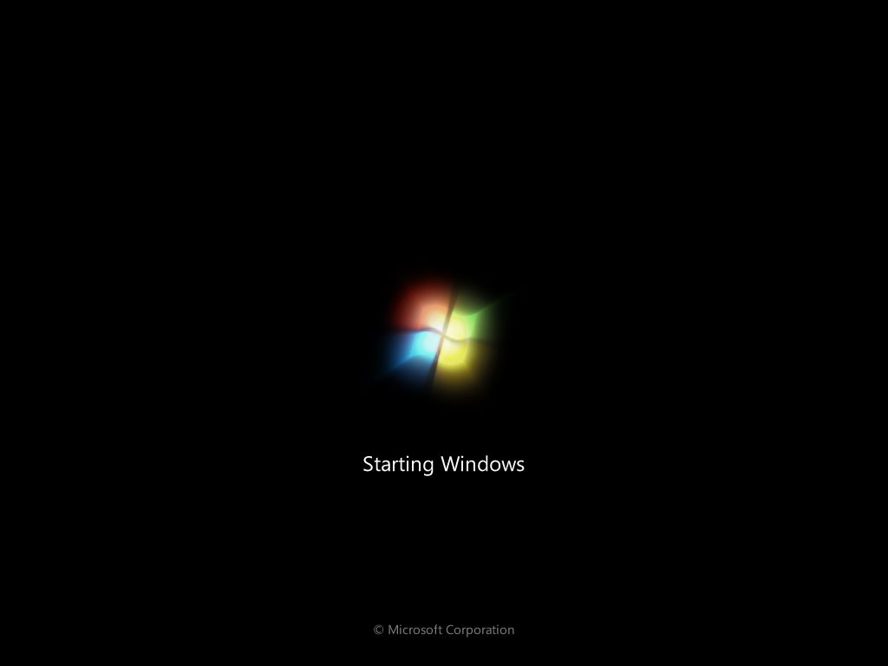

  <h1 style="text-align: center;font-weight: bold">Praktikum 1 Sistem Operasi</h1>
  <h4 style="text-align: center;">Dosen Pengampu : Dr. Ferry Astika Saputra, S.T., M.Sc.</h4>

 

  
  <h3 style="text-align: center;">Disusun Oleh : </h3>
  

    <strong>Muhammad Rafi Dhiyaulhaq (312350004) </strong> 
    <strong>Arva Zaki Fanadzan (3123500014) </strong> 
    <strong>Fauzan Abderrashed (3123500020)</strong>
  

<h3 style="text-align: center;line-height: 1.5">Politeknik Elektronika Negeri Surabaya Departemen Teknik Informatika Dan Komputer Program Studi Teknik Informatika 2023/2024</h3>
  

## Daftar Isi
1. [Pendahuluan](#Pendahuluan)
2. [Soal](#soal)

##Pendahuluan
Apa itu Sistem Operasi? 
<strong>Sistem Operasi</strong> adalah perangkat lunak pada lapisan pertama yang ditempatkan pada memori komputer pada saat komputer dinyalakan (<i>booting</i>). Sedangkan <i>software</i> lainnya dijalankan setelah sistem operasi berjalan, dan sistem operasi akan melakukan layanan inti untuk software tersebut.

## Soal
#### Sebutkan dan jelaskan proses booting !
1 . <strong>Power ON</strong>

Saat tombol power atau tombol reset dihidupkan, sumber daya listrik akan mengalir ke komputer.
Kemudian, perangkat keras akan menerima daya untuk dinyalakan.

2 . <strong>POST (Power On Selft Test)</strong>

Setelah dinyalakan, komputer akan melakukan Power-On Self-Test atau POST, yang merupakan serangkaian tes perangkat keras untuk memastikan bahwa semuanya berfungsi dengan baik. 
POST akan memeriksa RAM, prosesor, kartu grafis, dan perangkat keras lainnya. 

3 . <strong>Inisialisasi perangkat keras</strong>

Setelah POST selesai, komputer akan menginisialisasi perangkat keras seperti hard drive, keyboard, mouse, dan perangkat lainnya. 
Proses ini melibatkan tahap mengenali perangkat keras, memuat driver yang diperlukan, dan menyiapkan perangkat untuk digunakan.

4 . <strong>Membaca sektor boot</strong>

Selanjutnya, komputer akan mencari sektor boot di hard drive atau perangkat penyimpanan lainnya. 
Sektor boot adalah area khusus yang berisi instruksi awal untuk memuat sistem operasi.

5 . <strong>Memuat Sistem Operasi</strong>
Setelah sektor boot ditemukan, komputer akan memuat sistem operasi ke dalam memori utama (RAM). 
Kemudian, sistem operasi akan mengambil alih kendali dan mulai menjalankan program-program yang diperlukan untuk mengoperasikan komputer.

#### Bagaimana cara install Oracle Virtual Box dan Debian dalam Virtual Box ?

## Instalasi Oracle Virtual Box
1. Masuk ke laman [Oracle Virtual box](https://www.virtualbox.org/wiki/Downloads), lalu unduh sesuai sistem operasi yang anda gunakan. Disini saya sudah menambahkan file Oracle Virtualbox beserta file Debian yang nanti akan digunakan

3. Buka setup Oracle dan klik Next.

4. Klik Install.

5. Oracle sedang dalam proses pengunduhan.

6. Oracle Virtual Box telah di install, klik finish.

6.Tampilan awal akan terlihat seperti ini

## Instalasi Linux Debian dalam Oracle Virtual Box
1. Buka Oracle Virtual Box, lalu klik opsi "New".

2. Isi nama, pilih letak penyimpanan Virtual Box, masukkan file ISO debian yang telah diunduh, klik "Skip unattended Installation, dan klik Next.

3. Tentukan RAM dan jumlah CPU yang diinginkan, lalu klik Next.

4. Tentukan ukuran storage didalam Virtual Machine,  lalu klik Next.

5. Dalam tampilan ini, anda dapat melihat ulang pilihan yang anda telah pilih sebelumnya, jika sudah sesuai keinginan, pilih Finish.

Ini adalah tampilan Linux Debian pada Oracle

## Mengkonfigurasi Debian dalam Oracle Virtual Box
1. Klik "Start" untuk membuka Virtual Machine.

2. Pilih Graphical Install untuk memulai konfigurasi Debian.

3. Pilih Bahasa, lalu klik continue.

4. Pilih lokasi, lalu klik continue.

5. Pilih konfigurasi bahasa Keyboard, lalu klik continue.

6. Isi Hostname, lalu klik continue.

7. Untuk nama domain tidak perlu diisi, klik continue.

8. Isi root password, lalu klik continue.

9. Isi nama, lalu klik continue.

10. Isi username, lalu klik continue.

11. Pilih lokasi jam, lalu klik continue.

12. Untuk partition disk, pilih manual, lalu klik continue.

13. Pilih opsi seperti pada gambar dibawah, lalu klik continue.

14. Pilih "Yes" untuk membuat partition disk baru, lalu klik continue.

15. Pilih pri/log untuk membuat bagian partition disk, lalu klik continue.

16. Pilih "create new partition disk" untuk membuat partition disk, lalu klik continue.

17. Tentukan jumlah penyimpanan partition disk pertama, lalu klik continue.

18. Pilih "primary" agar menjadikan penyimpanan utama, lalu klik continue.

19. Pilih "beginning", lalu klik continue.

20. pilih opsi "done setting up the partition" klik continue.

21. Setelah membuat partition disk pertama, silahkan membuat partition disk ke dua, tentukan isi penyimpanan yang ukurannya lebih kecil dibandingkan partition disk pertama, lalu klik continue.

23. Untuk partition disk kedua, pilih opsi primary dan pada mount point pilih Enter manually dan ketik "/storage", lalu klik continue.

25. Setelah membuat partition disk kedua, silahkan membuat partition disk ke tiga, tentukan isi penyimpanan yang ukurannya lebih kecil dibandingkan partition disk kedua, lalu klik continue.

26. Untuk partition disk kedua, pilih opsi logical, lalu jadikan "swap area" pada bagian "use as:", lalu klik continue.

27. Cek ulang seperti gambar dibawah, jika sudah sesuai, klik continue.

28. Pilih opsi "No", lalu klik continue.

29. Pilih opsi "No", lalu klik continue.

30. Pilih lokasi terdekat untuk mengunduh package manager, lalu klik continue.

31. Pilih archive mirror, lalu klik continue.

32. Pada bagian ini tidak perlu diisi, klik continue

33. Pilih opsi "Yes", lalu klik continue.

35. Tidak perlu mengubah apa-apa, tekan continue.

36. Pilih opsi yes, lalu klik Continue

37. Pilih /dev/sda, lalu klik continue.

39. Instalasi dan konfigurasi Debian telah selesai, klik continue dan Virtual machine akan me-reboot. 

40. Tampilan Linux Debian setelah reboot.

