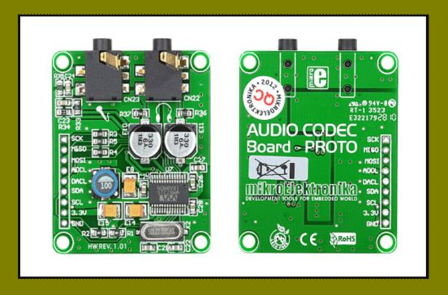

  <h1 style="text-align: center;font-weight: bold">Praktikum 1 Sistem Operasi</h1>
  <h4 style="text-align: center;">Dosen Pengampu : Dr. Ferry Astika Saputra, S.T., M.Sc.</h4>

 

  
  <h3 style="text-align: center;">Disusun Oleh : </h3>
  

    <strong>Fauzan Abderrasheed (3123500020) </strong> 
    <strong>Muhammad Rafi Dhiyaulhaq (3123500004) </strong> 
    <strong>Arva Zaki Fanadzan (3123500014)</strong>
  

<h3 style="text-align: center;line-height: 1.5">Politeknik Elektronika Negeri Surabaya Departemen Teknik Informatika Dan Komputer Program Studi Teknik Informatika 2023/2024</h3>
  

## Daftar Isi
1. [Pendahuluan](#apa-itu-motherboard)
2. [Soal](#soal)

## Apa itu Motherboard?
<strong>Motherboard</strong> adalah suatu papan sirkuit dalam komputer yang terdiri dari beberapa bagian. Bagian-bagian motherboard memiliki fungsi dan cara kerjanya masing-masing.

Motherboard sendiri merupakan perangkat yang berfungsi untuk menyediakan konektivitas kepada beberapa perangkat keras yang ada dalam komputer, seperti seperti prosesor (CPU), memori (RAM), hard drive, dan kartu video.

Untuk memberikan konektivitas kepada perangkat keras tersebut, motherboard membutuhkan bagian-bagian tertentu yang menunjang fungsi kerjanya.

## Komponen Motherboard

### CPU / Processor Socket
Soket prosesor adalah komponen yang terdiri dari dua jenis, yaitu ZIF (model soket terbaru) dan LIF (model soket yang lama). Soket prosesor memiliki sejumlah fungsi.

Fungsi utama dari soket prosesor adalah untuk meletakkan prosesor dan menghubungkannya melalui lubang-lubang yang disesuaikan dengan kaki dari prosesor. Dudukan ini berbentuk segi empat dengan lubang-lubang kecil tempat tertancapnya kaki-kaki (pin-pin) prosesor yang tersusun membentuk matriks 2 dimensi. Yang berfungsi untuk meletakan processor ke motherboard.

### BIOS 
BIOS merupakan suatu program dasar yang dipakai antara motherboard dan sistem operasi. Artinya, BIOS memiliki fungsi sebagai penghubung antara perangkat lunak dan perangkat keras dalam suatu komputer.

Program BIOS sendiri terdiri dari ROM (Read Only Memory) yang berfungsi untuk mengatur suatu komponen yang terhubung pada motherboard agar dapat bekerja.

BIOS merupakan perangkat lunak atau program antarmuka tingkat dasar yang menurut fungsi motherboard berguna untuk mengatur proses input dan output data pada sebuah komputer.

### Chip Northbridge Controller 
North bridge controller adalah bagian atau komponen dalam motherboard yang mempunyai fungsi sebagai penghubung antara slot RAM, slot AGP, dan socket CPU.

Northbridge adalah komponen yang menghubungkan procossor (CPU) ke sistem memori dan graphics controller (AGP dan PCI Express) melalui bus berkecepatan tinggi, dan ke southbridge. Fungsi dari Northbridge sendiri yaitu menjembatani arus data di sekitar main Memory, Prosesor, Front Side Bus dan AGP Bus juga mengatur kerja power management.

### Chip Southbridge Controller 
Southbridge bisa dibilang bagian chipset yang menangani komponen yang tidak ditangani northbridge. South Bridge Controller merupakan chip yang memiliki nilai penting bagi komputer. Fungsi komponen ini ialah untuk mengendalikan periferal pada perangkat komputer, seperti ROM BIOS, USB, keyboard, IDE controller, mouse, modem, LAN, dan lainnya. Southbridge memiliki jembatan penghubung dengan kecepatan busnya lebih lambat dari pada jembatan penghubung yang digunakan oleh northbridge.

### Power Supply Unit Connectors
Bagian ini merupakan komponen berupa pin yang berfungsi untuk menghubungkan motherboard dengan power supply. Jenis power supply yang saat ini banyak digunakan adalah jenis ATX yang membantu mematikan daya komputer tanpa perlu menekan tombol daya. Konektor power pada motherboard adalah Pin yang menyambungkan motherboard dengan power supply di casing sebuah komputer. Agar si motherboard menerima daya dari power supply.

### CMOS
CMOS merupakan baterai dalam komputer yang membantu untuk memberikan daya kepada suatu memori motherboard untuk mengatur konfigurasi dalam sistem tersebut. 

CMOS ( Complementary Metal Oxide Semiconductor ) termasuk bagian bagian motherboard dan berfungsi sebagai penyimpan aturan BIOS lalu menyalurkan daya saat komputer mati.

CMOS bisa dikatakan sebagai RAM yang memiliki kapasitas kecil dan menjadi media penyimpanan data hardware, pengaturan tanggal dan waktu, pengaturan BIOS, pengaturan booting, dll.

### Slot IDE 
IDE ( Integrated Device Electronic ) menjadi bagian bagian motherboard laptop yang memiliki fungsi untuk menghubungkan Harddisk atau Optical Drive seperti CD-ROM, DVD, dan sebagainya. IDE (Integrated Device Electronic) adalah suatu komponen yang berfungsi untuk mendukung perangkat hard disk atau floppy disk. Slot IDE sendiri merupakan tempat penempatan IDE dalam motherboard.

### Slot RAM
RAM merupakan singkatan dari Random Access Memory. Slot RAM menjadi urutan petama dari bagian bagian motherboard yang berfungsi untuk meletakkan RAM Saat ini, perangkat komputer banyak menggunakan untuk motherboard baru yang menggunakan tipe DDR3.

### SATA
Slot SATA adalah suatu komponen dalam motherboard yang memiliki fungsi untuk menghubungkan komponen dengan sambungan perangkat SATA.

SATA sendiri merupakan bus primer pada komputer yang didesain untuk mentransfer data dari motherboard ke media penyimpanan data, seperti hard disk dan optical drive pada komputer.

### CPU Fan Power Supply Connector
Bagian ini adalah komponen yang berfungsi untuk menyambungkan komputer dengan kipas CPU. Kipas ini memiliki fungsi untuk mendinginkan CPU. Seperti halnya kipas yang digunakan ketika kita kepanasan, itulah CPU Fan yang memiliki fungsi utama yaitu untuk menjaga CPU agar tetap dalam suhu stabil.

### Flash ROM
Memori kilat atau flash ROM adalah salah satu tipe PROM (Programmable Read Only Memory) berfungsi untuk membaca, menulis, mencari tahu, verifikasi dan menghilangkan chip kilat yang bisa  terbaca dan terprogram. Berbeda dengan RAM, jenis memori ini dapat menyimpan datanya tanpa membutuhkan penyediaan listrik.

### Super I/O Controller 
Super I/O Controller adalah suatu komponen dalam motherboard yang berupa sirkuit yang memuat beberapa soket, seperti untuk mesin pencetak, mouse, keyboard dan lain-lain.

### Audio Codec
Audio codec merupakan chip kecil berukuran 0,25 x 0,25 inci (7 x 7 mm) yang terletak di motherboard yang bertanggung jawab atas fungsi audio analog. Audio Codec merupakan alat yang ada didalam, fungsi motherboard bagian ini untuk mengkodekan audio analog sebagai audio digital lalu menerjemahkan kembali ke audio analog.

## Referensi
<ul>
<li><a href = "https://kumparan.com/kabar-harian/bagian-bagian-motherboard-dan-fungsinya-1xjCtdWcq23">Referensi 1</a?></li>
<li><a href = "https://www.soaltekno.com/bagian-bagian-motherboard-dan-fungsinya/">Referensi 2</a?></li>
<li><a href = "https://www.kiosbarcode.com/blog/20-komponen-motherboard-pada-komputer/">Referensi 3</a?></li>

</ul>