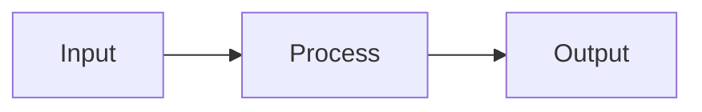

<div align="center">
  <h1 style="text-align: center;font-weight: bold">Operasi Input Output<br>Sistem Operasi</h1>
  <h4 style="text-align: center;">Dosen Pengampu : Dr. Ferry Astika Saputra, S.T., M.Sc.</h4>
</div>
<br />
<div align="center">
  
  <h3 style="text-align: center;">Disusun Oleh : </h3>
  <p style="text-align: center;">
    <strong>Fauzan Abderrasheed (3123500020) </strong><br>
    <strong>Muhammad Rafi Dhiyaulhaq (3123500004) </strong><br>
    <strong>Arva Zaki Fanadzan (3123500014)</strong>
  </p>
<h3 style="text-align: center;line-height: 1.5">Politeknik Elektronika Negeri Surabaya<br>Departemen Teknik Informatika Dan Komputer<br>Program Studi Teknik Informatika<br>2023/2024</h3>
  <hr><hr>
</div>


# Operasi Input Output
Referensi : [Shell Programming](https://www.geeksforgeeks.org/introduction-linux-shell-shell-scripting/?ref=shm_)
## POKOK BAHASAN:
```
* Pipeline
* Redirection
```
## DASAR TEORI:

### 1. PROSES I/O
Sebuah proses memerlukan Input dan Output. Instruksi (command) yang diberikan pada Linux melalui Shell disebut sebagai eksekusi program yang selanjutnya disebut proses. Setiap kali instruksi diberikan, maka Linux kernel akan menciptakan sebuah proses dengan memberikan nomor PID (Process Identity). Proses dalam Linux selalu membutuhkan Input dan menghasilkan suatu Output.



Dalam konteks Linux input/output adalah :
* Keyboard (input)
* Layar (output)
* Files
* Struktur data kernel
* Peralatan I/O lainnya (misalnya Network)

## 2. FILE DESCRIPTOR

Linux berkomunikasi dengan file melalui file descriptor yang direpresentasikan melalui angka yang dimulai dari 0, 1, 2 dan seterusnya. Tiga buah file descriptor standar yang lalu diciptakan oleh proses adalah :
* 0 = keyboard (standar input)
* 1 = layar (standar output)
* 2 = layar (standar error)

Linux tidak membedakan antara peralatan hardware dan file. Linux memanipulasi peralatan hardware dengan memperlakukannya sama dengan ketika memperlakukan sebuah file.

## 3.PEMBELOKAN (REDIRECTION)

Pembelokan dilakukan untuk standard input, output dan error, yaitu untuk mengalihkan file descriptor dari 0, 1 dan 2. Simbol untuk pembelokan adalah :
```mermaid
flowchart LR
    A(Standart Input) -->|Keyboard| B{Process}
    B -->|Monitor| C[Standart Output]
    B -->|Monitor| D[Standart Error]
 ```

## 4. PIPA (PIPELINE)
Mekanisme pipa digunakan sebagai alat komunikasi antar proses.

```mermaid
graph LR
  A(Input) --> B(Proses-1) --> C(Output) --> D(Input) --> E(Proses-2) --> F(Output)
```
Proses-1 menghasilkan output yang selanjutnya digunakan sebagai input oleh Proses-2. Hubungan output input ini dinamakan ``pipa ataiupipelining``, yang menghubungkan Proses-1 dengan Proses-2 dan dinyatakan dengan symbol “|”.
```
    Proses1 | Proses
```

## 5. FILTER
Filter adalah utilitas Linux yang dapat memproses standard input (dari keyboard) dan menampilkan hasilnya pada standard output (layar). Contoh filter adalah cat, sort, grep, pr, head, tail, paste dan lainnya.
Pada sebuah rangkaian pipa : 

        P<sub>1</sub> | P<sub>2</sub> | P<sub>3</sub> ... | P<sub>n-1</sub> | P<sub>n</sub>

Maka P2 sampai dengan P<sub>n-1</sub> berfungsi sebagai filter. P1 (awal) dan Pn (terakhir) boleh tidak filter. Utilitas yang bukan filter misalnya who, ls, ps, lp, lpr, mail dan lainnya.
Beberapa perintah Linux yang digunakan untuk proses penyaringan antara lain :
* Perintah ``grep``
  Digunakan untuk menyaring masukannya dan menampilkan baris-baris yang hanya mengandung pola yang ditentukan. Pola ini disebut regular expression.
* Perintah ``wc``
  Digunakan untuk menghitung jumlah baris, kata dan karakter dari baris-baris masukan yang diberikan kepadanya. Untuk mengetahui berapa baris gunakan option –l, untuk mengetahui berapa kata, gunakan option –w dan untuk mengetahui berapa karakter, gunakan option –c. 
  Jika salah satu option tidak digunakan, maka tampilannya adalah jumlah baris, jumlah kata dan jumlah karakter.
* Perintah ``sort``
  Digunakan untuk mengurutkan masukannya berdasarkan urutan nomor ASCII dari karakter.
* Perintah ``cut``
  Digunakan untuk mengambil kolom tertentu dari baris-baris masukannya, yang ditentukan pada option –c.
* Perintah ``uniq``
  Digunakan untuk menghilangkan baris-baris berurutan yang mengalami duplikasi, biasanya digabungkan dalam pipeline dengan ``sort``.

## TUGAS PENDAHULUAN:

## Jawablah pertanyaan-pertanyaan di bawah ini :

1. Apa yang dimaksud redirection?
2. Apa yang dimaksud pipeline?
3. Apa yang dimaksud perintah di bawah ini :
    echo, cat, more, sort, grep, wc, cut, uniq

## PERCOBAAN:

1. Login sebagai user.
2. Bukalah Console Terminal dan lakukan percobaan-percobaan di bawah ini. Perhatikan hasil setiap percobaan.
3. Selesaikan soal-soal latihan.
