<div align="center">
  <h1 style="text-align: center;font-weight: bold">Operasi Input Output<br>Sistem Operasi</h1>
  <h4 style="text-align: center;">Dosen Pengampu : Dr. Ferry Astika Saputra, S.T., M.Sc.</h4>
</div>
<br />
<div align="center">
  
  <h3 style="text-align: center;">Disusun Oleh : </h3>
  <p style="text-align: center;">
    <strong>Fauzan Abderrasheed (3123500020) </strong><br>
    <strong>Muhammad Rafi Dhiyaulhaq (3123500004) </strong><br>
    <strong>Arva Zaki Fanadzan (3123500014)</strong>
  </p>
<h3 style="text-align: center;line-height: 1.5">Politeknik Elektronika Negeri Surabaya<br>Departemen Teknik Informatika Dan Komputer<br>Program Studi Teknik Informatika<br>2023/2024</h3>
  <hr><hr>
</div>


# Operasi Input Output
Referensi : [Shell Programming](https://www.geeksforgeeks.org/introduction-linux-shell-shell-scripting/?ref=shm_)
## POKOK BAHASAN:
```
* Pipeline
* Redirection
```
## DASAR TEORI:

### 1. PROSES I/O
Sebuah proses memerlukan Input dan Output. Instruksi (command) yang diberikan pada Linux melalui Shell disebut sebagai eksekusi program yang selanjutnya disebut proses. Setiap kali instruksi diberikan, maka Linux kernel akan menciptakan sebuah proses dengan memberikan nomor PID (Process Identity). Proses dalam Linux selalu membutuhkan Input dan menghasilkan suatu Output.


Dalam konteks Linux input/output adalah :
* Keyboard (input)
* Layar (output)
* Files
* Struktur data kernel
* Peralatan I/O lainnya (misalnya Network)

## 2. FILE DESCRIPTOR

Linux berkomunikasi dengan file melalui file descriptor yang direpresentasikan melalui angka yang dimulai dari 0, 1, 2 dan seterusnya. Tiga buah file descriptor standar yang lalu diciptakan oleh proses adalah :
* 0 = keyboard (standar input)
* 1 = layar (standar output)
* 2 = layar (standar error)

Linux tidak membedakan antara peralatan hardware dan file. Linux memanipulasi peralatan hardware dengan memperlakukannya sama dengan ketika memperlakukan sebuah file.

## 3.PEMBELOKAN (REDIRECTION)

Pembelokan dilakukan untuk standard input, output dan error, yaitu untuk mengalihkan file descriptor dari 0, 1 dan 2. Simbol untuk pembelokan adalah :
```mermaid
flowchart LR
    A(Standart Input) -->|Keyboard| B{Process}
    B -->|Monitor| C[Standart Output]
    B -->|Monitor| D[Standart Error]
 ```

## 4. PIPA (PIPELINE)
Mekanisme pipa digunakan sebagai alat komunikasi antar proses.

```mermaid
graph LR
  A(Input) --> B(Proses-1) --> C(Output) --> D(Input) --> E(Proses-2) --> F(Output)
```
Proses-1 menghasilkan output yang selanjutnya digunakan sebagai input oleh Proses-2. Hubungan output input ini dinamakan ``pipa ataiupipelining``, yang menghubungkan Proses-1 dengan Proses-2 dan dinyatakan dengan symbol “|”.
```
    Proses1 | Proses
```

## 5. FILTER
Filter adalah utilitas Linux yang dapat memproses standard input (dari keyboard) dan menampilkan hasilnya pada standard output (layar). Contoh filter adalah cat, sort, grep, pr, head, tail, paste dan lainnya.
Pada sebuah rangkaian pipa : 

        P<sub>1</sub> | P<sub>2</sub> | P<sub>3</sub> ... | P<sub>n-1</sub> | P<sub>n</sub>

Maka P2 sampai dengan P<sub>n-1</sub> berfungsi sebagai filter. P1 (awal) dan Pn (terakhir) boleh tidak filter. Utilitas yang bukan filter misalnya who, ls, ps, lp, lpr, mail dan lainnya.
Beberapa perintah Linux yang digunakan untuk proses penyaringan antara lain :
* Perintah ``grep``
  Digunakan untuk menyaring masukannya dan menampilkan baris-baris yang hanya mengandung pola yang ditentukan. Pola ini disebut regular expression.
* Perintah ``wc``
  Digunakan untuk menghitung jumlah baris, kata dan karakter dari baris-baris masukan yang diberikan kepadanya. Untuk mengetahui berapa baris gunakan option –l, untuk mengetahui berapa kata, gunakan option –w dan untuk mengetahui berapa karakter, gunakan option –c. 
  Jika salah satu option tidak digunakan, maka tampilannya adalah jumlah baris, jumlah kata dan jumlah karakter.
* Perintah ``sort``
  Digunakan untuk mengurutkan masukannya berdasarkan urutan nomor ASCII dari karakter.
* Perintah ``cut``
  Digunakan untuk mengambil kolom tertentu dari baris-baris masukannya, yang ditentukan pada option –c.
* Perintah ``uniq``
  Digunakan untuk menghilangkan baris-baris berurutan yang mengalami duplikasi, biasanya digabungkan dalam pipeline dengan ``sort``.

## TUGAS PENDAHULUAN:

## Jawablah pertanyaan-pertanyaan di bawah ini :

1. Apa yang dimaksud redirection?
- Redirection mengacu pada teknik untuk mengalihkan aliran input dan output dari suatu program. Dengan redirection, Anda dapat mengalihkan output dari sebuah perintah agar disimpan dalam file atau menggunakan output tersebut sebagai masukan untuk perintah lainnya.
2. Apa yang dimaksud pipeline?
   - Pipeline adalah mekanisme yang memungkinkan output dari satu perintah (program) digunakan sebagai input untuk perintah lainnya secara langsung, tanpa perlu menyimpan output ke dalam file terlebih dahulu.
3. Apa yang dimaksud perintah di bawah ini :
    echo, cat, more, sort, grep, wc, cut, uniq
    - ``echo``  digunakan untuk mencetak atau menampilkan teks atau variabel ke terminal atau ke output standar.
    - ``cat`` digunakan untuk mencantumkan, menggabungkan, dan menulis konten atau isi file dalam output standar
    - ``more`` untuk Melihat isi suatu file dengan fasilitas melihat isi file dari atas dan untuk kebawah menggunakan tombol Enter untuk perbaris dan tombol Spasi untuk perlayar
    - ``sort`` Digunakan untuk mengurutkan masukannya berdasarkan urutan nomor ASCII dari karakter.
    - ``grep`` Digunakan untuk menyaring masukannya dan menampilkan baris-baris yang hanya mengandung pola yang ditentukan. Pola ini disebut regular expression.
    - ``wc`` Digunakan untuk menghitung jumlah baris, kata dan karakter dari baris-baris masukan yang diberikan kepadanya.
    - ``cut`` Digunakan untuk mengambil kolom tertentu dari baris-baris masukannya, yang ditentukan pada option –c.
    - ``uniq`` Digunakan untuk menghilangkan baris-baris berurutan yang mengalami duplikasi, biasanya digabungkan dalam pipeline dengan ``sort``.

## PERCOBAAN:

1. Login sebagai user.
2. Bukalah Console Terminal dan lakukan percobaan-percobaan di bawah ini. Perhatikan hasil setiap percobaan.
3. Selesaikan soal-soal latihan.
   
1. Output ke layar (standar output), input dari system (kernel)
    ```
    $ ps
    ```
   
   Hasil Output

   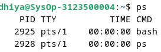
    Analisa 
   
   ``$ps`` kependekan dari Process Status, digunakan untuk menampilkan
   informasi terkait proses yang sedang berjalan di Linux.
   <br>

2. Output ke layar (standar output), input dari keyboard (standard input)
   ```
    $ cat
    hallo, apa khabar
    hallo, apa khabar
    exit dengan ^d
    exit dengan ^d
    [Ctrl-d]
   ```

   Hasil Output
   
   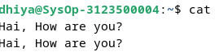

   
   Analisa

   ``cat`` digunakan untuk mencantumkan, menggabungkan, dan menulis konten atau isi file dengan mengambil input dari keyboard dan menampilkan output ke layar.
   <br>

3. Input nama direktori, output tidak ada (membuat direktori baru), bila terjadi error maka tampilan error pada layar (standard error)
   ```
   $ mkdir mydir
   $ mkdir mydir **(Terdapat pesan error)**
   ```

   Hasil Output
   
   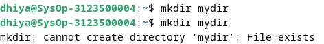

    Analisa 

   ``mkdir`` disini merupakan perintah yang digunakan untuk membuat directory baru. Input dari mkdir adalah nama dari direktori baru yang ingin dibuat. Output-nya adalah direktori baru yang bisa dilihat menggunakan perintah ``ls`` atau dilihat dalam aplikasi files. 


## Percobaan 2 : Pembelokan (redirection)
1. Pembelokan standar output
   ```
    $ cat 1> myfile.txt
    Ini adalah teks yang saya simpan ke file myfile.txt
   ```

   Hasil Output
   
   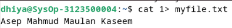

    Analisa 

   ``1>`` merupakan salah satu metode pembelokan pengganti standar output. Alternatifnya yaitu menggunakan ``>``
   <br>

2. Pembelokan standar input, yaitu input dibelokkan dari keyboard menjadi dari file
   ```
    $ cat 0< myfile.txt
    $ cat myfile.txt
   ```

   Hasil Output
   
   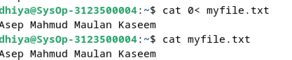

       ``0<`` merupakan salah satu metode pembelokan standar input, yaitu input dibelokkan dari keyboard menjadi dari file. Alternatifnya yaitu dengan menggunakan ``<``
   <br>

3. Pembelokan standar error untuk disimpan di file
   ```
    $ mkdir mydir (Terdapat pesan error)
    $ mkdir mydir 2> myerror.txt
    $ cat myerror.txt
   ```

   Hasil Output
   
   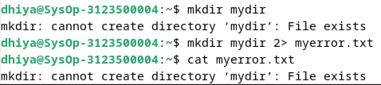

    ``2>`` merupakan metode pembelokan standar error yang kemudian disimpan ke dalam file. Yaitu yang dimaksud adalah membelokkan pesan error dari suatu perintah yang dijalankan agar pesan error tersebut tersimpan ke dalam file.
   <br>

4. Notasi 2>&1 : pembelokan standar error (2>) adalah identik dengan file descriptor 1.
   ```
    $ ls filebaru (Terdapat pesan error)
    $ ls filebaru 2> out.txt
    $ cat out.txt
    $ ls filebaru 2> out.txt 2>&1
    $ cat out.txt
   ```

   Hasil Output
   
   

      Analisa

   Notasi ``2>&1`` merupakan pembelokan standar error ``2>`` adalah identik dengan file descriptor 1. Digunakan untuk mengarahkan output standar error dari suatu perintah ke tempat yang sama dengan output standar.
   <br>

5. Notasi 1>&2 (atau >&2) : pembelokan standar output adalah sama dengan file descriptor 2 yaitu standar error
   ```
   $ echo “mencoba menulis file” 1> baru
   $ cat filebaru 2> baru 1>&
   $ cat baru
   ```
   Hasil Output
   
   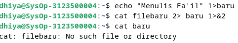

   
   Analisa

   Notasi ``1>&2`` (atau ``>&2``) pembelokan standar output adalah sama dengan file descriptor yaitu standar error. Mengindikasikan bahwa output standar dari suatu perintah akan diarahkan ke tempat yang sama dengan output standar error. 
   <br>

6. Notasi >> (append)
   ```
   $ echo “kata pertama” > surat
   $ echo “kata kedua” >> surat
   $ echo “kata ketiga” >> surat
   $ cat surat
   $ echo “kata keempat” > surat
   $ cat surat
   ```

   Hasil Output
   
   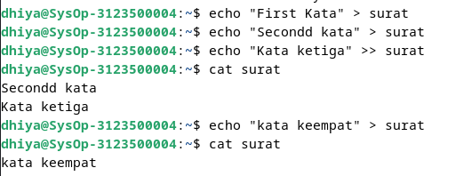

   Analisa

   Notasi append ``>>`` digunakan untuk membelokkan tampilan standard output ke dalam file tanpa menghapus isi dari file sebelumnya.
   <br>

7. Notasi here document (<<++ .... ++) digunakan sebagai pembatas input dari keyboard. Perhatikan bahwa tanda pembatas dapat digantikan dengan tanda apa saja, namun harus sama dan tanda penutup harus diberikan pada awal baris
   ```
   $ cat <<++
   Hallo, apa kabar?
   Baik-baik saja?
   Ok!
   ++
   $ cat <<%%%
   Hallo, apa kabar?
   Baik-baik saja?
   Ok!
   %%%
   ```

   Hasil Output
   
   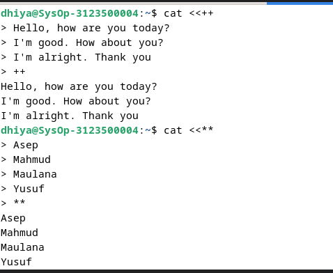

  
   Analisa 

   Notasi here document (<<++ .... ++) digunakan sebagai pembatas input dari keyboard. Tanda pembatas dapat menggunakan tanda apa saja dengan syarat tanda penutup harus sama dengan tanda di awal baris, jika pada contoh diatas tanda pembatas menggunakan ++ dan %%%.
   <br>
8. Notasi – (input keyboard) adalah representan input dari keyboard. Artinya menampilkan file 1, kemudian menampilkan input dari keyboard dan menampilkan file 2. Perhatikan bahwa notasi “-“ berarti menyelipkan input dari keyboard
  ```
  $ cat myfile.txt – surat
  ```
  Hasil Output

  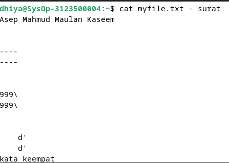

  Analisa

   Notasi – (input keyboard) adalah representan input dari keyboard. Artinya menampilkan file 1, kemudian menampilkan input dari keyboard dan menampilkan file 2. Perhatikan bahwa notasi “-“ berarti menyelipkan input dari keyboard


## Percobaan 3 : Pipa (pipeline)

1. Operator pipa (|) digunakan untuk membuat eksekusi proses dengan melewati data langsung ke data lainnya.
   ```
   $ who
   $ who | sort
   $ who | sort –r
   $ who > tmp
   $ sort tmp
   $ rm tmp
   $ ls –l /etc | more
   $ ls –l /etc | sort | more
   ```

   Hasil Output
   
   

   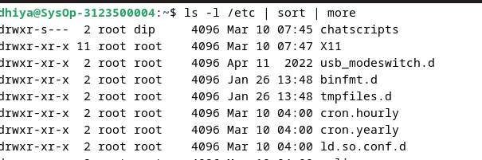

   Analisa

   Pipeline memungkinkan pengguna untuk menggabungkan beberapa perintah secara efisien, dengan output dari satu perintah menjadi input untuk perintah berikutnya. Hal ini sangat berguna untuk memproses dan menganalisis data secara langsung tanpa perlu menyimpannya dalam file sementara
   <br>


2. Untuk membelokkan standart output ke file, digunakan operator ">"
   ```
   $ echo hello
   $ echo hello > output
   $ cat output
   ```

   Hasil Output
   
   

    Analisa

   Membelokkan standard output untuk disimpan ke dalam file menggunakan operator ``>`` lalu mencetaknya menggunakan ``cat``
   <br>

3. Untuk menambahkan output ke file digunakan operator ">>"
   ```
   $ echo bye >> output
   $ cat output
   ```

   Hasil Output
   
   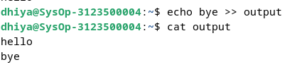

    Analisa

   Menambahkan output ke file tanpa menghapus isi dari file sebelumnya menggunakan operator ``>>``


4. Untuk membelokkan standart input digunakan operator "<"
   ```
   $ cat < output
   ```

   Hasil Output
   
   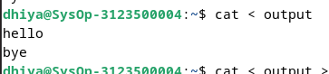

    Analisa

   Membelokkan standard input menggunakan operator ``<``, jadi dalam hal ini file output menjadi standard input. 
   <br>

5. Pembelokan standart input dan standart output dapat dikombinasikan tetapi tidak boleh menggunakan nama file yang sama sebagai standart input dan output.
   ```
   $ cat < output > out
   $ cat out
   $ cat < output >> out
   $ cat out
   $ cat < output > output
   $ cat output
   $ cat < out >> out (Proses tidak berhenti)
   [Ctrl-c]
   $ cat out
   ```

   Hasil Output
   
   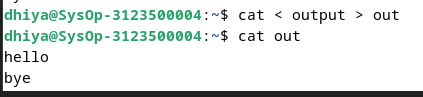
   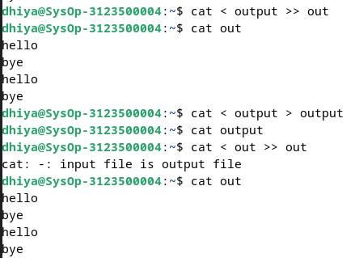

   Analisa 

   Pembelokan standart input dan standart output dapat dikombinasikan tetapi     tidak boleh menggunakan nama file yang sama sebagai standart input dan        output


## Percobaan 4 : Filter
1. Pipa juga digunakan untuk mengkombinasikan utilitas sistem untuk membentuk fungsi yang lebih kompleks
   ```
    $ w –h | grep <user>
    $ grep <user> /etc/passwd
    $ ls /etc | wc
    $ ls /etc | wc –l
    $ cat > kelas1.txt
    Badu
    Zulkifli
    Yulizir
    Yudi
    Ade
    [Ctrl-d]
    $ cat > kelas2.txt
    Budi
    Gama
    Asep
    Muchlis
    [Ctrl-d]
    $ cat kelas1.txt kelas2.txt | sort
    $ cat kelas1.txt kelas2.txt > kelas.txt
    $ cat kelas.txt | sort | uniq
   ```

   Hasil Output
   
   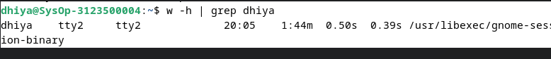

   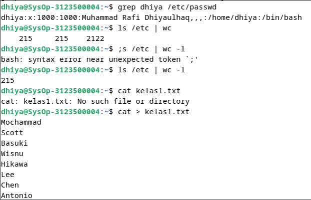

   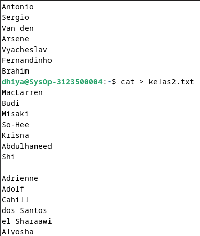

   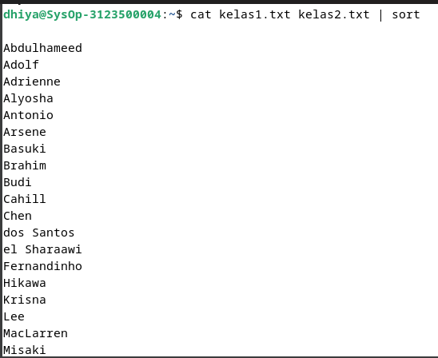

   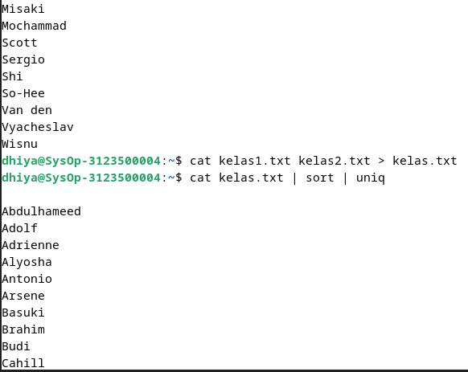

   
## LATIHAN:

1. Lihat daftar secara lengkap pada direktori aktif, belokkan tampilan standard output   ke file baru.

   Hasil Output
   
    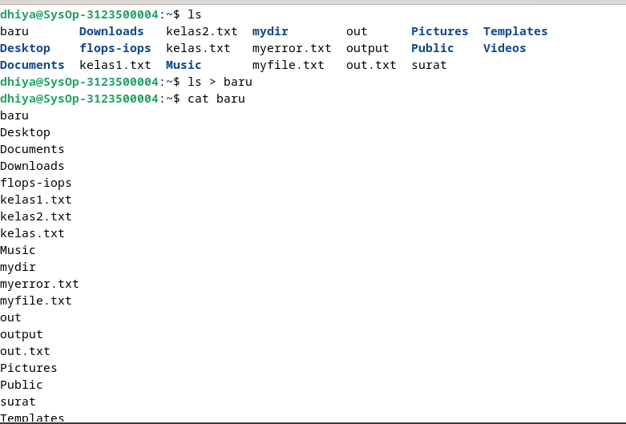

   Analisa

   Pada latihan ini perintah pertama yang digunakan adalah ``ls`` yaitu untuk    melihat daftar file, lalu membelokkan output dari ``ls`` untuk disimpan ke    dalam file baru, lalu cetak baru.
   <br>

2. Lihat daftar secara lengkap pada direktori /etc/passwd, belokkan tampilan standard output ke file baru tanpa menghapus file baru sebelumnya.

   Hasil Output
   
   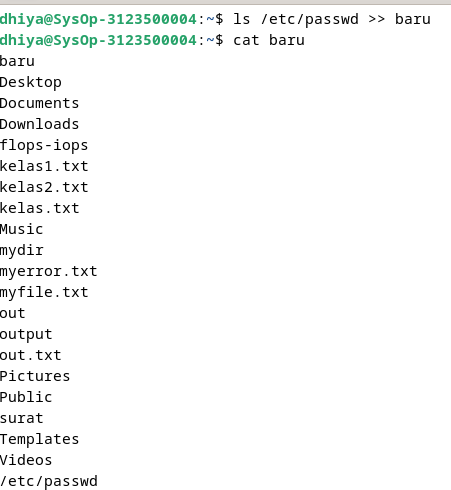

   Analisa

    Menggunakan ``ls`` untuk melihat direktori /etc/passwd, dan membelokkan outputnya ke dalam file baru tanpa mengahapus isi dari file baru sebelumnya menggunakan operator ``>>``
   <br>

3. Urutkan file baru dengan cara membelokkan standard input.

   Hasil Output
   
   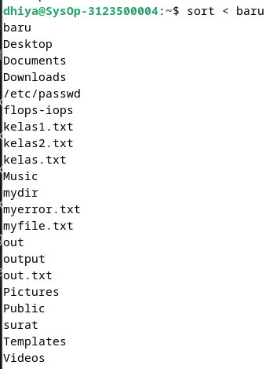

    Analisa 

    Membelokkan standard input dari file baru dengan perintah sort untuk          mengurutkan isi dari file baru sesuai dengan huruf pertama. Disini file       baru menjadi input dari perintah sort.
   <br>

4. Urutkan file baru dengan cara membelokkan standard input dan standard output ke file baru.urut.

   Hasil Output
   
   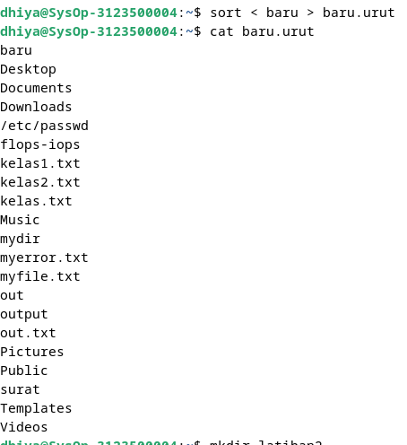

    Analisa 

   Membelokkan standard input dari file baru dengan perintah sort untuk       
   mengurutkan isi dari file baru sesuai dengan huruf pertama. Disini file   
   baru menjadi input dari perintah sort. Lalu output dari perintah ``sort < 
   baru`` dibelokkan ke dalam file baru.urut, dan dicetak menggunakan cat.
   <br>


5. Buatlah direktori latihan 2 sebanyak 2 kali dan belokkan standard error ke file rmdirerror.txt.

   Hasil Output
   
   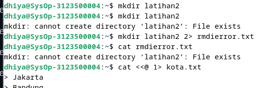

   Analisa 

   Membuat direktori latihan2 menggunakan perintah ``mkdir`` sebanyak 2 kali,    lalu akan terjadi output error. Output error tersebut dibelokkan ke dalam     file rmdierror.txt menggunakan operator pembelokan standard error yaitu       ``2>``. Lalu mencetak file rmdierror.txt menggunakan perintah ``cat``.
   <br>

6. Urutkan kalimat berikut :
   ```
   Jakarta
   Bandung
   Surabaya
   Padang
   Palembang
   Lampung
   ```
   Dengan menggunakan notasi **here document (<@@@ ...@@@)** . [HINT](https://www.geeksforgeeks.org/how-to-use-here-document-in-bash-programming/)

      Hasil Output
      
      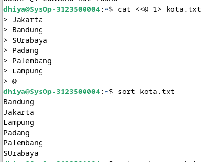

     Analisa

      Membuat list nama kota menggunakan notasi here document ``<@....@`` dan       menyimpannya ke dalam file kota.txt, lalu mengurutkan isi dari file           tersebut menggunakan perintah sort. 
      <br>
  
  

7. Hitung jumlah baris, kata dan karakter dari file baru.urut dengan menggunakan filter dan tambahkan data tersebut ke file baru.

   Hasil Output
   
   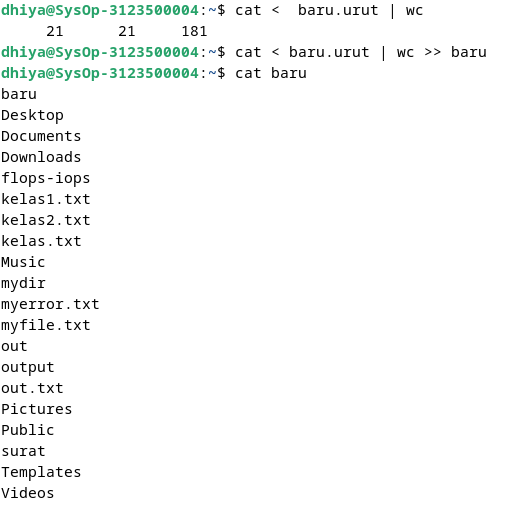

   Analisa 

   Membelokkan standard input dari cat, sehingga file baru.urut menjadi input    untuk perintah cat. Lalu dengan menggunakan pipeline dilanjutkan dengan perintah wc untuk menghitung jumlah baris, kata dan karakter dari file baru.urut. Output dari perintah yang tadi dibelokkan menuju file baru tanpa menghapus isi dari file baru sebelumnya menggunakan operator ``>>``
   <br>


8. Gunakan perintah di bawah ini dan perhatikan hasilnya.
   ```
    $ cat > hello.txt
    dog cat
    cat duck
    dog chicken
    chicken duck
    chicken cat
    dog duck
    [Ctrl-d]
    $ cat hello.txt | sort | uniq
    $ cat hello.txt | grep “dog” | grep –v “cat”
   ```

   Hasil Output
   
   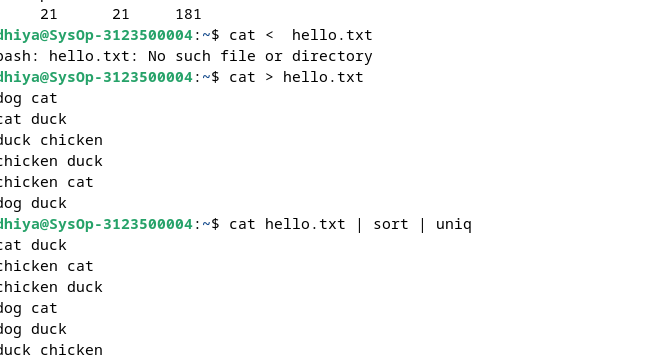
   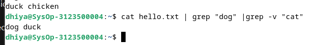

     Analisa 

   Pada perintah `$ cat > hello.txt`, membuat file baru bernama "hello.txt" dan memasukkan beberapa baris teks yang berisi kata-kata seperti "dog", "cat", "duck", dan "chicken". Kemudian, perintah `$ cat hello.txt | sort | uniq` membaca isi dari "hello.txt", mengurutkannya secara alfabetis dengan `sort`, dan kemudian menghilangkan baris-baris yang sama menggunakan `uniq`, sehingga hanya menampilkan setiap kata sekali saja. Sementara itu, perintah `$ cat hello.txt | grep "dog" | grep -v "cat"` membaca isi "hello.txt", menyaring baris yang mengandung kata "dog" dengan `grep`, dan kemudian menghilangkan baris yang juga mengandung kata "cat" dengan menggunakan opsi `-v` di `grep`, sehingga hanya menampilkan baris yang mengandung kata "dog" namun tidak mengandung kata "cat".


## LAPORAN RESMI:

1. Analisa hasil percobaan 1 sampai dengan 4, untuk setiap perintah jelaskan    tampilannya.
2. Kerjakan latihan diatas dan analisa hasilnya
3. Berikan kesimpulan dari praktikum ini.

Redirection mengacu pada teknik untuk mengalihkan aliran input dan output dari suatu program. Dengan redirection, Anda dapat mengalihkan output dari sebuah perintah agar disimpan dalam file atau menggunakan output tersebut sebagai masukan untuk perintah lainnya.<br>
Pipeline adalah mekanisme yang memungkinkan output dari satu perintah (program) digunakan sebagai input untuk perintah lainnya secara langsung, tanpa perlu menyimpan output ke dalam file terlebih dahulu.<br
Ada beberapa perintah yang digunakan dalam praktikum ini di antaranya <br>
 - ``echo``  digunakan untuk mencetak atau menampilkan teks atau variabel ke terminal atau ke output standar.
    - ``cat`` digunakan untuk mencantumkan, menggabungkan, dan menulis konten atau isi file dalam output standar
    - ``more`` untuk Melihat isi suatu file dengan fasilitas melihat isi file dari atas dan untuk kebawah menggunakan tombol Enter untuk perbaris dan tombol Spasi untuk perlayar
    - ``sort`` Digunakan untuk mengurutkan masukannya berdasarkan urutan nomor ASCII dari karakter.
    - ``grep`` Digunakan untuk menyaring masukannya dan menampilkan baris-baris yang hanya mengandung pola yang ditentukan. Pola ini disebut regular expression.
    - ``wc`` Digunakan untuk menghitung jumlah baris, kata dan karakter dari baris-baris masukan yang diberikan kepadanya.
    - ``cut`` Digunakan untuk mengambil kolom tertentu dari baris-baris masukannya, yang ditentukan pada option –c.
    - ``uniq`` Digunakan untuk menghilangkan baris-baris berurutan yang mengalami duplikasi, biasanya digabungkan dalam pipeline dengan ``sort``.
