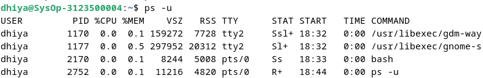
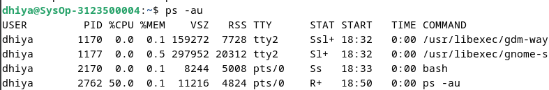

  <h1 style="text-align: center;font-weight: bold">Praktikum 4A Sistem Operasi</h1>
  <h4 style="text-align: center;">Dosen Pengampu : Dr. Ferry Astika Saputra, S.T., M.Sc.</h4>

 

  
  <h3 style="text-align: center;">Disusun Oleh : </h3>
  

    <strong>Fauzan Abderrasheed (3123500020) </strong> 
    <strong>Muhammad Rafi Dhiyaulhaq (3123500004) </strong> 
    <strong>Arva Zaki Fanadzan (3123500014)</strong>
  

<h3 style="text-align: center;line-height: 1.5">Politeknik Elektronika Negeri Surabaya Departemen Teknik Informatika Dan Komputer Program Studi Teknik Informatika 2023/2024</h3>
  

<h1 style="text-align: center;font-weight: bold">Proses dan Manajemen Proses</h1>

### POKOK BAHASAN

- Proses pada Sistem Operasi Linux
- Manajemen Proses pada Sistem Operasi Linux

### TUJUAN BELAJAR

Setelah mempelajari materi dalam bab ini, mahasiswa diharapkan mampu:

- Memahami konsep proses pada sis tem operasi Linux.
- Menampilkan beberapa cara menampilkan hubungan proses parent dan child.
- Menampilkan status proses dengan beberapa format berbeda.
- Melakukan pengontrolan proses pada shell.
- Memahami penjadwalan prioritas.

### DASAR TEORI

#### 1. KONSEP PROSES PADA SISTEM OPERASI LINUX

Proses adalah program yang sedang dieksekusi. Setiap kali menggunakan utilitas sistem atau program aplikasi dari shell, satu atau lebih proses ”child” akan dibuat oleh shell sesuai perintah yang diberikan. Setiap kali instruksi dibe rikan pada Linux shell, maka kernel akan menciptakan sebuah proses-id. Proses ini disebut juga dengan terminology Unix sebagai sebuah Job. Proses Id (PID) dimulai dari 0, yaitu proses INIT, kemudian diikuti oleh proses berikutnya (terdaftar pada /etc/inittab).
Beberapa tipe proses :

- Foreground  
  Proses yang diciptakan oleh pemakai langsung pada terminal (interaktif, dialog)
- Batch  
  Proses yang dikumpulkan dan dijalankan secara sekuensial (satu persatu). Prose Batch tidak diasosiasikan (berinteraksi) dengan terminal.
- Daemon  
  Proses yang menunggu permintaan (request) dari proses lainnya dan menjalankan tugas sesuai dengan permintaan tersebut. Bila tidak ada request, maka program ini akan berada dalam kondisi “idle” dan tidak menggunakan waktu hitung CPU. Umumnya nama proses daemon di UNIX berakhiran d, misalnya inetd, named, popd dll

#### 2. SINYAL

Proses dapat mengirim dan menerima sinyal dari dan ke proses lainnya. Proses mengirim sinyal melalui instruksi “kill” dengan format  

    kill [-nomor sinyal] PID

Nomor sinyal : 1 s/d maksimum nomor sinyal yang didefinisikan system Standar nomor sinyal yang terpenting adalah :

| No Sinyal | Nama    | Deskripsi                                                                             |
| --------- | ------- | ------------------------------------------------------------------------------------- |
| 1         | SIGHUP  | Hangup, sinyal dikirim bila proses terputus, misalnya melalui putusnya hubungan modem |
| 2         | SIGINT  | Sinyal interrupt, melalui ^C                                                          |
| 3         | SIGQUIT | Sinyal Quit, melalui ^\|                                                              |
| 9         | SIGKILL | Sinyal Kill, menghentikan proses                                                      |
| 15        | SIGTERM | Sinyal terminasi software                                                             |

#### 3. MENGIRIM SINYAL

Mengirim sinyal adalah satu alat komunikasi antar proses, yaitu memberitahukan proses yang sedang berjalan bahwa ada sesuatu yang harus dikendalikan. Berdasarkan sinyal yang dikirim ini maka proses dapat bereaksi dan administrator/programmer dapat menentukan reaksi tersebut. Mengirim sinyal menggunakan instruksi

    kill [-nomor sinyal] PID

Sebelum mengirim sinyal PID proses yang akan dikirim harus diketahui terlebih dahulu.

#### 4. MENGONTROL PROSES PADA SHELL

Shell menyediakan fasilitas job control yang memungkinkan mengontrol beberapa job atau proses yang sedang berjalan pada waktu yang sama. Misalnya bila melakukan pengeditan file teks dan ingin melakukan interrupt pengeditan untuk mengerjakan hal lainnya. Bila selesai, dapat kembali (switch) ke editor dan melakukan pengeditan file teks kembali. 
Job bekerja pada <strong>foreground</strong> atau <strong>background</strong>. Pada foreground hanya diper untukkan untuk satu job pada satu waktu. Job pada foreground akan mengontrol shell - menerima input dari keyboard dan mengirim output ke layar. Job pada background tidak menerima input dari terminal, biasanya berjalan tanpa memerlukan interaksi 
Job pada foreground kemungkinan dihentikan sementara (suspend), dengan menekan [Ctrl-Z]. Job yang dihentikan sementara dapat dijalankan kembali pada foreground atau background sesuai keperluan dengan menekan <strong>”fg”</strong> atau <strong>”bg”</strong>. Sebagai catatan, menghentikan job seme ntara sangat berbeda dengan melakuakan interrupt job (biasanya menggunakan [Ctrl-C]), dimana job yang diinterrup akan dimatikan secara permanen dan tidak dapat dijalankan lagi.

#### 5. MENGONTROL PROSES LAIN

Perintah ps dapat digunakan untuk menunjukkan semua proses yang sedang berjalan pada mesin (bukan hanya proses pada shell saat ini) dengan format :

    ps –fae atau
    ps -aux

Beberapa versi UNIX mempunyai utilitas sistem yang disebut top yang menyediakan cara interaktif untuk memonitor aktifitas sistem. Statistik secara detail dengan proses yang berjalan ditampilkan dan secara terus-menerus di-refresh . Proses ditampilkan secara terurut dari utilitas CPU. Kunci yang berguna pada top adalah

    s – set update frequency
    u – display proses dari satu user
    k – kill proses (dengan PID)
    q – quit

Utilitas untuk melakukan pengontrolan proses dapat ditemukan pada sistem UNIX adalah perintah killall. Perintah ini akan menghentikan proses sesuai PID atau job number proses.

## Daftar isi
1. [Jawaban Tugas Pendahuluan](#tugas-pendahuluan)
2. [Laporan Hasil Percobaan](#percobaan)

## Tugas Pendahuluan
Jawablah pertanyaan-pertanyaan di bawah ini :
1. Apa yang dimaksud dengan proses ?

    - Proses adalah Program yang sedang diekseskusi

2. Apa yang dimaksud perintah untuk menampilkan status proses :
    `ps`, `pstree`.

    - Perintah `ps` dalam sistem operasi Linux digunakan untuk menampilkan informasi tentang proses-proses yang sedang berjalan di sistem.
    - Sama halnya dengan perintah `ps`, `pstree` juga mempunyai fungsi yang sama untuk melihat status proses yang berjalan pada sistem. Tetapi informasinya ditampilkan dalam bentuk pohon secara hirarkis yang menunjukkan hubungan antara proses-proses tersebut. 

3. Sebutkan opsi yang dapat diberikan pada perintah ps

    - `$ps` untuk melihat kondisi proses yang ada

    - `$ps -u` untuk melihat faktor/element lainnya

    - `$ps -u <user>` mencari proses yang spesifik pemakai

    - `$ps -a` mencari proses lainnya (all)

    - `$ps -au` mencari proses lainnya (all user)

    - `$ps -eH` untuk semua proses, H untuk hirarki tampilan proses

    - `$ps -e f` menampilkan status proses dengan karakter grafis

4. Apa yang dimaksud dengan sinyal ? Apa perintah untuk mengirim sinyal ?

    - Sinyal adalah cara yang digunakan oleh sistem operasi untuk mengirim pesan ke proses. Signal ini bisa digunakan untuk berbagai hal, seperti memberhentikan proses, memberi tahu proses untuk memuat kembali konfigurasi, dan lain-lain.

    -  Proses mengirim sinyal melalui instruksi `kill` dengan format `kill [-nomor sinyal] PID`.

5. Apa yang dimaksud dengan proses foreground dan background pada job control ?

    - Pada foreground hanya diperuntukkan untuk satu job pada satu waktu. Job pada foreground akan mengontrol shell - menerima input dari keyboard dan mengirim output ke layar. Job pada background tidak menerima input dari terminal, biasanya berjalan tanpa memerlukan interaksi.

6. Apa yang dimaksud perintah-perintah penjadwalan prioritas :
    `top`, `nice`, `renice`

    - `top`: Memonitor / memantau aktivitas system secara real-time 
    - `nice`: Mengubah prioritas eksekusi proses yang sudah berjalan
    - `renice`: mengurangi prioritas pada proses.

## Percobaan
1. Login sebagai user.
2. Download program C++ untuk menampilkan bilangan prima yang bernama
primes

    
    

    Analisa : 
    Program di atas menampilkan bilangan prima sampai ke N. Ketika dijalankan, program meminta input N dari pengguna dan menampilkan bilangan prima sampai mencapai bilangan N.

3. Lakukan percobaan-percobaan di bawah ini kemudian analisa hasil percobaan.
4. Selesaikan soal-soal latihan.

### Percobaan 1 : Status Proses

1. Pindah ke command line terminal (tty2) dengan menekan Ctrl+Alt+F2 
dan login ke terminal sebagai user

2. Instruksi `ps`

    

    Analisa : 
    Instruksi `ps` digunakan untuk melihat kondisi proses yang ada 

3. Instruksi `ps -u`

    

    Analisa : 
    Instruksi `ps -u` (user), digunakan untuk melihat elemen/faktor lain dari kondisi proses yang ada serta menampilkan nama user

4. Instruksi `ps -u <user>`

    

    Analisa :
    Mencari proses yang spesifik pemakai. Proses diatas hanya terbatas pada proses milik pemakai. Perintah tersebut digunakan untuk menampilkan proses pada user yang kita inginkan.

5. Instruksi `ps -a`

    

    Analisa :
    Perintah tersebut digunakan untuk menampilkan daftar dari semua proses yang sedang berjalan

6. Instruksi `ps -au`

    

    Analisa :
    Perintah ps -au digunakan untuk menampilkan informasi yang lebih rinci tentang semua proses yang sedang berjalan, termasuk proses yang dimiliki oleh pengguna (termasuk proses terminal yang sedang dijalankan) dan proses sistem.

7. Logout dan tekan Alt+F7 untuk kembali ke mode grafis

### Percobaan 2 : Menampilkan Hubungan Proses Parent and Child

1. Pindah ke command line terminal (tty2) dengan menekan Ctrl+Alt+F2 
dan login ke terminal sebagai user

2. Instruksi `ps -eH`

    

    Analisa : 
    Perintah tersebut digunakan untuk menampilkan seluruh proses secara hierarki. Dimana opsi *e* digunakan untuk memilih semua proses dan opsi *H* untuk menghasilkan tampilan proses secara hierarki. 

3. Instruksi `ps -e f`

    

    Analisa : 
    Menghasilkan tampilan serupa dengan langkah 2. Opsi *f* disini berfungsi untuk menampilkan STAT dari sebuah proses dan menampilkan status proses dengan karakter grafis ( \ dan _ ) 

4. Instruksi `pstree`

    

    Analisa : 
    Gambar diatas tampak seperti pohon atau diagram. Perintah tersebut berfungsi untuk menampilkan struktur proses yang berjalan di sistem secara hirarkis parent/child.

5. Instruksi `pstree | grep mingetty`

    

    Analisa : 
    Perintah ini berfungsi untuk menampilkan semua proses mingetty yang berjalan pada sistem yang berupa console virtual. Pada gambar diatas tidak ada output yang keluar dikarenakan tidak ada proses mingetty yang sedang berjalan

6. Instruksi `pstree -p`

    

    Analisa : 
    Perintah `pstree` -p dalam sistem operasi Linux adalah varian dari perintah pstree yang menampilkan struktur proses dalam bentuk pohon, namun dengan tambahan informasi tentang ID proses (PID) untuk setiap proses yang ditampilkan.

7. Instruksi `pstree -h`

    

    Analisa : 
    Dalam sistem Linux, perintah `pstree -h` digunakan untuk menampilkan struktur proses dalam bentuk pohon dengan opsi "human-readable" yang menyederhanakan ukuran angka yang besar ke format yang lebih mudah dipahami manusia.

### Percobaan 3 : Menampilkan Status Proses dengan Berbagai Format

1. Pindah ke command line terminal (tty2) dengan menekan Ctrl+Alt+F2 
dan login ke terminal sebagai user

2. Instruksi `ps -e | more`

    

    Analisa : 
    Perintah `ps -e | more` berfungsi untuk menampilkan daftar semua proses yang sedang berjalan di sistem secara berurutan, dan outputnya akan ditampilkan secara bertahap menggunakan perintah `more`

3. Instruksi `ps ax | more`

    

    Analisa : 
    Opsi a akan menampilkan semua proses yang dihasilkan terminal (TTY). Opsi x menampilkan semua proses yang tidak dihasilkan terminal. Yang kemudian outputnya ditampilkan secara bertahap menggunakan perintah `more`

4. Instruksi `ps ef | more`

    

    Analisa : 
    Ketika perintah `ps – ef | more` dieksekusi maka opsi *-ef* akan menampilkan semua proses dalam format daftar penuh. Yang kemudian outputnya ditampilkan secara bertahap menggunakan perintah `more`

5. Instruksi `ps -eo pid,cmd | more`

    

    Analisa : 
    Opsi `–eo` akan menampilkan semua proses dalam format sesuai definisi user yaitu terdiri dari kolom PID dan CMD. Yang kemudian outputnya akan ditampilkan secara bertahap menggunakan perintah `more`

6. Instruksi `ps -eo pid,ppid,%mem,cmd | more`

    

    Analisa : 
    Perintah `ps -eo pid,ppid,%mem,cmd | more` akan menampilkan kolom PID, PPID dan %MEM. Dimana PPID adalah proses ID dari proses parent. %MEM menampilkan persentasi memory system yang digunakan proses. Jika proses hanya menggunakan sedikit memory system akan ditampilkan 0.

7. Logout dan tekan Alt+F7 untuk kembali ke mode grafis
    
### Percobaan 4 : Mengontrol Proses pada Shell

1. Pindah ke command line terminal (tty2) dengan menekan Ctrl+Alt+F2 dan login ke terminal sebagai user.

2. Instruksi `yes`

    

    Analisa : 
    Perintah `yes` akan memberikan output huruf y yang tidak pernah berhenti. Untuk menghentikannya harus menggunakan *Ctrl + C*

3. Instruksi `yes > /dev/null`

    

    Analisa : 
    Membelokkan standard output dari perintah `yes` ke `/dev/null`. Untuk menghentikannya harus menggunakan *Ctrl + C*.

4. Instruksi `yes > /dev/null &`

    

    Analisa : 
    Salah satu cara agar perintah `yes` tetap dijalankan tetapi shell tetap digunakan untuk hal yang lain dengan meletakkan proses pada background dengan menambahkan karakter `&` pada akhir perintah. `[1]` merupakan job number PID.

5. Instruksi `jobs`

    

    Analisa : 
    Perintah di atas digunakan untuk melihat status proses yang telah digunakan.

6. Instruksi `kill %<nomor jobs>`

    Analisa : 
    Perintah `kill` digunakan untuk menghentikan job diikuti oleh *job number* atau PID Proses. Untuk identifikasi job number, penulisan perintah diikuti prefix dengan karakter `%`.

7. Instruksi `jobs`

    

    Analisa : 
    Ini adalah tahap terakhir, yaitu menggunakan perintah `jobs` untuk melihat status job setelah diterminasi.
