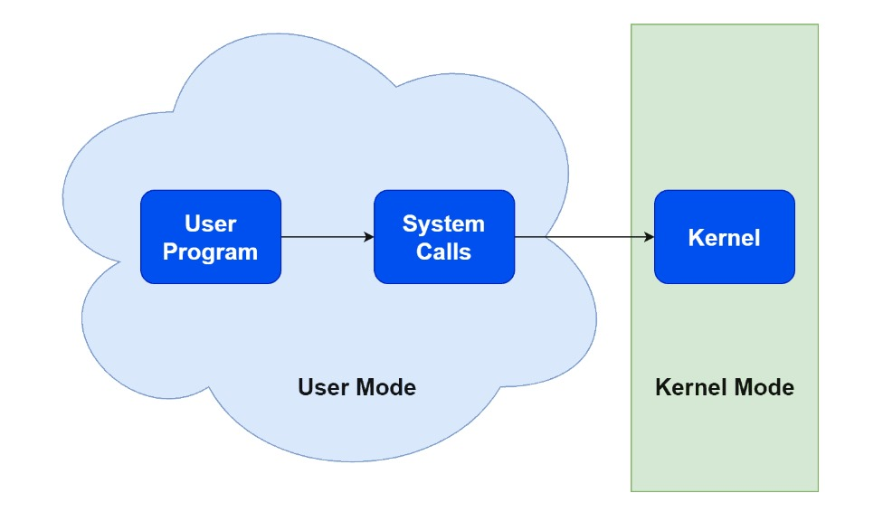
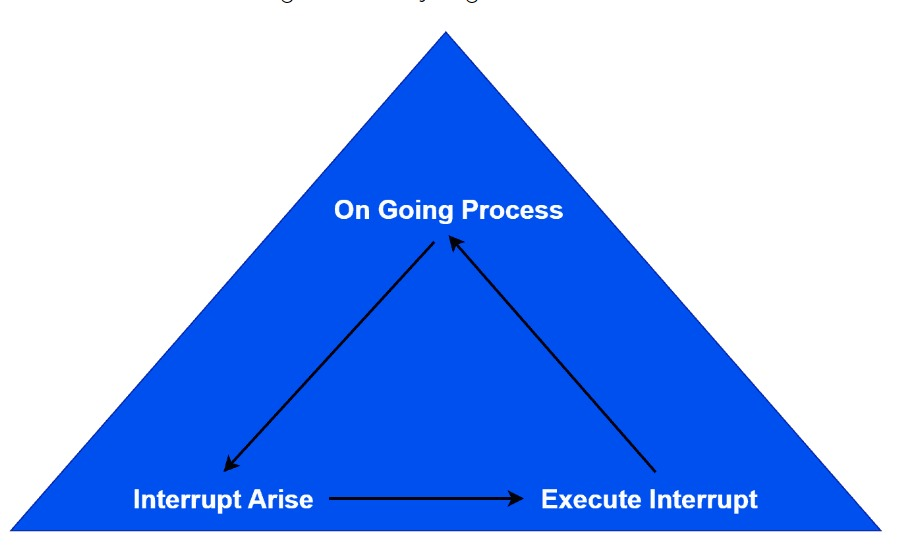

  <h1 style="text-align: center;font-weight: bold">Praktikum 4B Sistem Operasi</h1>
  <h4 style="text-align: center;">Dosen Pengampu : Dr. Ferry Astika Saputra, S.T., M.Sc.</h4>

 

  
  <h3 style="text-align: center;">Disusun Oleh : </h3>
  

    <strong>Fauzan Abderrasheed (3123500020) </strong> 
    <strong>Muhammad Rafi Dhiyaulhaq (3123500004) </strong> 
    <strong>Arva Zaki Fanadzan (3123500014)</strong>
  

<h3 style="text-align: center;line-height: 1.5">Politeknik Elektronika Negeri Surabaya Departemen Teknik Informatika Dan Komputer Program Studi Teknik Informatika 2023/2024</h3>
  

<h1 style="text-align: center;font-weight: bold">Proses dan Manajemen Proses</h1>

### Percobaan 5 : Menghentikan dan Memulai Kembali Job

1. Instruksi `yes > /dev/null`

    

    Analisa : 
    Cara lain meletakkan job pada background dengan memulai job secara normal (pada foreground), stop job dan memulai lagi pada background. Gunakan perintah `yes > /dev/null` untuk memulai job baru. Hentikan sementara job (suspend), bukan menghentikannya (terminate), tetapi menghentikan sementara job sampai di restart. Untuk menghentikan sementara job gunakan *Ctrl + Z*

2. Instruksi `fg`

    

    Analisa : 
    Perintah `fg` disini digunakan untuk me-restart job pada *foreground*.

3. Instruksi `bg`

    

    Analisa : 
    Setelah instruksi `fg`, Shell akan menampilkan nama perintah yang diletakkan di *foreground*. Stop job lagi dengan *Ctrl + Z*. Kemudian gunakan perintah `bg` untuk meletakkan job pada *background*. 
     
    Instruksi `fg`

    

    Analisa : 
    Job tidak bisa dihentikan dengan *Ctrl + Z* karena job berada pada *background*. Untuk menghentikannya, letakkan job pada *foreground* dengan `fg` dan kemudian hentikan sementara dengan *Ctrl + Z*.

4. Instruksi `yes &`

    

    Analisa : 
    Job pada *background* dapat digunakan untuk menampilkan teks pada terminal, dimana dapat diabaikan jika mencoba mengerjakan job lain seperti perintah di atas. Untuk menghentikannya tidak dapat menggunakan *Ctrl + C*. Job harus dipindah ke *foreground* baru diberhentikan dengan cara tekan `fg` dan tekan enter, Kemudian lanjutkan dengan *Ctrl + Z* untuk menghentikan sementara

5. Instruksi `fg %2`, `bg %2` atau `%2`

    

    Analisa : 
    Perintah di atas digumakan apabila ingin menjalankan banyak job dalam satu waktu, letakkan job pada *foreground* atau *background* dengan memberikan job ID. 

6. Instruksi `fg`

    

    Analisa : 
    tekan `fg` dan tekan *Enter*, kemudian dilanjutkan dengan *Ctrl-Z* untuk menghentikan sementara

7. Instruksi `ps -fae`

    

    

    

    Analisa : 
    Lihat job dengan perintah `ps -fae` dan tekan Enter. Kemudian hentikan proses dengan perintah kill. Pada proses di atas proses yang dihentikan adalah proses dengan PID 6142, yaitu proses `yes > /dev/null`

8. Logout dan tekan Alt+F7 untuk kembali ke mode grafis

### Percobaan 6 : Percobaan dengan Penjadwalan Prioritas

1. Login sebagai root

2. Buka 3 terminal, tampilkan pada screen yang sama. 

    

3. Pada setiap terminal, ketik `PS1 = ” \w:”` diikuti Enter. `\w` menampilkan path pada direktori home.

    

4. Karena login sebagai root, maka akan ditampilkan `~:` pada setiap terminal. Untuk setiap terminal ketik `pwd` dan tekan *Enter* untuk melihat bahwa Anda sedang berada pada direktori `/root`.

    

5. Buka terminal lagi (keempat), atur posisi sehingga keempat terminal terlihat pada screen

    

6. Pada terminal keempat, ketik `top` dan tekan *Enter*. Maka program `top` akan muncul. Ketik `i`. Top akan menampilkan proses yang aktif. Ketik `lmt`. `Top` tidak lagi menampilkan informasi pada bagian atas dari screen. Pada percobaan ini, terminal ke empat sebagai jendela `Top`.

    

    

    

7. Pada terminal 1, bukalah program executable C++ dengan mengetik program `yes` dan tekan *Enter*.

    

8. Ulangi langkah 7 untuk terminal 2

      

9. Jendela Top akan menampilkan dua program `yes` sebagai proses yang berjalan. Nilai `%CPU` sama pada keduanya. Hal ini berarti kedua proses mengkonsumsi waktu proses yang sama dan berjalan sama cepat. *PID* dari kedua proses akan berbeda, misalnya pada contoh di bawah adalah 2835 dan 2837. Kemudian gunakan terminal 3 (yang tidak menjalankan primes maupun Jendela Top) dan ketik *renice 19 2835* dan diikuti Enter. Hal ini berarti mengganti penjadwalan prioritas dari proses ke 19.

      

      

10. Tunggu beberapa saat sampai program top berubah dan terlihat pada jendela `Top`. Pada kolom `STAT` memperlihatkan `N` untuk proses 2835. Hal ini berarti bahwa penjadwalan prioritas untuk proses 2835 lebih besar (lebih lambat) dari 0. Proses 2837 berjalan lebih cepat.

      

11. Program *top* juga mempunyai fungsi yang sama dengan program `renice`. Pilih Jendela *Top* dan tekan `r`. Program top terdapat prompt PID to renice: tekan 2835 dan tekan Enter. Program top memberikan prompt Renice PID 3148 to value: tekan -19 dan tekan Enter.

      

      

12. Tunggu beberapa saat sampai top berubah dan lihat nilai %CPU pada kedua proses. Sekarang proses 2835 lebih cepat dari proses 2837. Kolom status menunjukkan < pada proses 3148 yang menunjukkan penjadwalan prioritas lebih rendah (lebih cepat) dari nilai 0

      

13. Pilih terminal 3 (yang sedang tidak menjalankan yes atau program top) dan ketik nice –n -10 yes dan tekan Enter. Tunggu beberapa saat agar program top berubah dan akan terlihat proses primes ketiga. Misalnya PID nya 2845. Opsi -10 berada pada kolom NI (penjadwalan prioritas).

      

14. Jangan menggunakan mouse dan keyboard selama 10 detik. Program top menampilkan proses yang aktif selain program yes. Maka akan terlihat proses top terdaftar tetapi %CPU kecil (dibawah 1.0) dan konsisten. Juga terlihat proses berhubungan dengan dekstop grafis seperti X, panel dll.

      

15. Pindahkan mouse sehingga kursor berubah pada screen dan lihat apa yang terjadi dengan tampilan top. Proses tambahan akan muncul dan nilai %CPU berubah sebagai bagian grafis yang bekerja. Satu alasan adalah bahwa proses 2834 berjalan pada penjadwalan prioritas tinggi. Pilih jendela Top, ketik `r`. `PID to renice :` muncul prompt. Ketik 2834 dan tekan Enter. `Renice PID 2834 to value:` muncul prompt. Ketik 0 dan tekan Enter. Sekarang pindahkan mouse ke sekeliling screen. Lihat perubahannya

      

      

      

16. Tutup semua terminal window.

17. Logout dan login kembali sebagai user.

### Latihan 

1. Masuk ke tty2 dengan *Ctrl+Alt+F2*. Ketik `ps –au` dan tekan Enter. Kemudian perhatikan keluaran sebagai berikut :

    

    - Sebutkan nama-nama proses yang bukan root
        - Semua proses kecuali `/bin/login -p--` adalah bukan root 

    - Tulis PID dan COMMAND dari proses yang paling banyak menggunakan CPU time
        - PID : 2653
        - COMMAND : -bash

    - Sebutkan buyut proses dan PID dari proses tersebut
        - `/usr/libexec/gdm-wayland-session` dengan PID 1166

    - Sebutkan beberapa proses daemon
        - Pada beberapa proses yang tampil pada gambar di atas, tidak ada proses daemon.

    - Pada prompt login lakukan hal- hal sebagai berikut :
        `$ csh`
        `$ who`
        `$ bash`
        `$ ls`
        `$ sh`
        `$ ps`

        

        perintah `$ csh` adalah sebuah shell interaktif yang menawarkan lebih banyak sintaks dibandingkan dengan Bourne Shell. 
        perintah `$ bash` digunakan untuk mengkonversi instruksi yang dimasukkan ke dalam bahasa biner yang dapat dimengerti oleh kernel Linux. 
        perintah `$ ls` digunakan untuk menunjukkan semua file yang terletak dalam direktori aktif.
        perintah `$ sh` adalah singkatan dari Bourne Shell, yang bertindak sebagai interpreter perintah atau shell standar di unix.
        perintah `$ ps` digunakan untuk menampilkan daftar proses yang sedang berlangsung dalam sistem. Tampilan dari perintah ps mencakup empat kolom utama: PID, TTY, TIME, dan CMD.
        Perintah `$ who`digunakan untuk menampilkan daftar pengguna yang saat ini login ke sistem. Ini menampilkan informasi seperti nama pengguna, terminal yang mereka gunakan, waktu login, dan sebagainya. Perintah ini sering digunakan untuk memeriksa siapa yang sedang menggunakan sistem atau untuk melihat apakah ada pengguna yang login secara tidak sah.

    - Sebutkan PID yang paling besar dan kemudian buat urut-urutan proses sampai ke PPID = 1.

        

        1) PID = 2682 -> ps
        2) PID = 2681 -> sh
        3) PID = 2678 -> bash
        4) PID = 2676 -> csh
        5) PID = 2583 -> bash
        6) PID = 2064 -> bash

2. Cobalah format tampilan ps dengan opsi berikut dan perhatikan hasil tampilannya :
    - `-f` daftar penuh

          

        Analisa: 
        Opsi `-f` digunakan untuk menampilkan output informasi proses secara lengkap atau penuh. Infromasi tersebut mencakup UID (Username)/pengguna yang menjalankan proses, PID (Process ID), PPID (Process Parent ID), C (Informasi penjadwalan), STIME (Start Time), TTY, TIME, CMD (command).

    - `-j` format job

          

        Analisa:
        Dilihat dari hasil percobaan perintah `$ ps -j`, hasilnya menampilkan output informasi proses sistem dalam bentuk format job, informasi tersebut mencakup PID (Process ID), PGID (Process Group Leader), SID (Session Identifier/ Session Group), TTY, TIME, CMD (Command).

    - `j` format job control

          

        Analisa:
         Dari hasil percobaan perintah `$ ps j` di atas, hasilnya menampilkan proses sistem dalam bentuk BSD format job, yang mencakup informasi tentang PPID, PID, PGID, SID, TTY, TPGID (Task_Traced), STAT, UID, TIME, COMMAND.

    - `l` daftar memanjang

         

        Analisa:
        Dari hasil percobaan perintah `$ ps l` di atas, hasilnya menampilkan proses sistem dalam bentuk daftar memanjang (long format) dan menggambarkan gambaran yang lebih rinci tentang proses yang sedang berjalan di sistem linux. Hasilnya mencakup informasi yang berisi F (Flags), UID, PID, PPID, PRI (Priority of the process), NI (Nice value), VSZ (Virtual memory usage), RSS (Real memory usage), WCHAN(Memory address of the event the process is waiting for), STAT (Process status code), TTY, TIME, COMMAND. 

    - `s` format sinyal

        

        Analisa:
        Dilihat dari hasil percobaan perintah `$ ps s`, hasilnya menampilkan proses sistem dalam bentuk format sinyal. Opsi ini dapat digunakan untuk menampilkan informasi tentang sinyal yang dikirimkan kepada proses. Informasi yang diberikan oleh perintah ini mencakup tentang UID, PID, PENDING, BLOCKED, IGNORED, CAUGHT, STAT, TTY, TIME, COMMAND.

    - `v` format virtual memory

        

        Analisa: 
        Dilihat dari hasil percobaan perintah `$ ps v`. Dengan menggunakan perintah `ps v` kita dapat mendapatkan informasi tentang penggunaan memori virtual dan fisik oleh proses, status proses, dan lain-lain. Hasilnya mencakup tampilan proses sistem dalam bentuk virtual memory, hasilnya berisi PID, TTY, STAT, TIME, MAJFL (Number of major faults the system), TRS (Shows the text resident size), DRS (Shows the disk resident size), RSS (Shows the resident set size), %MEM, COMMAND.

    - `X` format register i386

        

        Analisa:
        Dilihat dari hasil percobaan perintah `$ ps X`, hasilnya menampilkan proses sistem dalam bentuk format register i368, hasilnya berisi PID, STACKP, ESP (Extended Stack Pointer), EIP, TMOUT, ALARM, STAT, TTY, TIME, COMMAND.

3. Lakukan urutan pekerjaan berikut :

    - Gunakan perintah `find` ke seluruh direktory pada sistem, belokkan output sehingga daftar direktori dialihkan ke file `directories.txt` dan daftar pesan error dialihkan ke file `errors.txt`

        

        Analisa:
        Dilihat dari hasil perintah `$ find -Type d > directories.txt 2> errors.txt` berfungsi untuk membelokkan standar output berupa daftar direktori ke dalam file directories.txt, kemudian jika terdapat pesan error, maka akan dibelokkan ke dalam file errors.txt. Namun, isi file tersebut kosong, yang artinya tidak ada pesan error yang muncul selama proses find / dilakukan.

    - Gunakan perintah `sleep 5`. Apa yang terjadi dengan perintah ini ?

        

        Analisa:
        Dilihat dari hasil perintah `$ sleep 5` yaitu digunakan untuk menghentikan proses job pada terminal selama 5 detik. `$ sleep` digunakan untuk menghentikan proses job pada terminal selama waktu yang ditentukan. Angka yang diketikkan merupakan durasinya dalam satuan detik.

    - Jalankan perintah pada background menggunakan `&`

        

        Analisa:
        Perintah `$ sleep 5 &` digunakan untuk memulai job pada background. Dapat di cek menggunakan perintah `bg`.

    - Jalankan `sleep 15` pada foreground, hentikan sementara dengan Ctrl-Z dan kemudian letakkan pada background dengan `bg`. Ketikkan `jobs`. Ketikkan `ps`. Kembalikan job ke foreground dengan perintah `fg`.

        

        Analisa: 
        Kita harus melakukan instruksi dalam range waktu 15 detik agar melihat prosesnya. Setelah proses sleep kita jalankan, kita hentikan sementara menggunakan *Ctrl + Z* lalu kita taruh pada background menggunakan perintah `bg`. Ketika melakukan perintah `$ jobs`, dapat dilihat bahwa job sleep 15 berjalan pada background. Untuk mengecek, lakukan perintah `$ ps` untuk melihat proses/job yang sedang berjalan, terdapat job sleep. Lalu kita kembalikan lagi job ke foreground dengan perintah `fg`

    - Jalankan `sleep 15` pada background menggunakan `&` dan kemudian gunakan perintah `kill` untuk menghentikan proses diikuti job number.

        

        Analisa:
        Perintah `$ sleep 15 &` digunakan untuk membuat job berjalan pada background. Untuk mengecek job nya, gunakan perintah `$ ps` dan terdapat proses sleep yang sedang running. Perintah `$ kill %1` digunakan untuk menghentikan proses sleep 15. Untuk mengecek, gunakan perintah `$ ps` yang ditandai dengan tulisan Terminated.

    - Jalankan `sleep 15` pada background menggunakan `&` dan kemudian gunakan `kill` untuk menghentikan sementara proses. Gunakan `bg` untuk melanjutkan menjalankan proses.

        

        Analisa:
        Opsi `-19` (SIGSTOP) pada perintah `$ kill -19 %1` digunakan untuk menghentikan proses sementara dengan indikator tulisan Stopped. Kemudian proses dimulai lagi dengan perintah `$ bg`. Untuk mengecek prosesnya, gunakan perintah `$ ps`.

    - Jalankan `sleep 60` pada background 5 kali dan terminasi semua pada dengan menggunakan perintah `killall`.

        

        Analisa:
        Perintah `$ sleep 60 &` sebanyak 5 kali digunakan untuk membuat 5 proses sleep pada background yang ditandai dengan 5 nomor job [..] yang berbeda-beda. Perintah `$ killall` yang diikuti dengan nama proses digunakan untuk menerminasi proses dengan command sleep dengan indikator tulisan Terminated.

    - Gunakan perintah `ps`, `w` dan `top` untuk menunjukkan semua proses yang sedang dieksekusi.

        

        

        Analisa: 
        Dilihat dari hasil, perintah `$ ps` menunjukkan proses status yang sedang aktif. Perintah `$ w` menunjukkan siapa saja user yang aktif. Perintah `$ top` digunakan untuk menunjukkan semua proses yang sedang dieksekusi

    - Gunakan perintah `ps –aeH` untuk menampilkan hierarki proses. Carilah init proses. Apakah Anda bisa identifikasi sistem daemon yang penting ? Dapatkan Anda identifikasi shell dan subproses ?

        

        

        

        Analisa:
        Init process adalah induk dari semua proses pada linux, ditandai dengan PID = 1 yaitu systemd. Sistem daemon yang penting disebut juga dengan init process dengan PID = 1. Selain itu, service deamon ditandai dengan huruf belakangnya d. Untuk shell, terdapat di terminal yang sedang aktif (pts/0) yaitu proses seperti bash dan ps.

    - Kombinasikan `ps –fae` dan grep, apa yang Anda lihat ?

        

        Analisa:
        Perintah `$ ps -fae` sendiri digunakan untuk menampilkan semua proses yang sedang berjalan pada mesin. Perintah tersebut bisa dikombinasikan dengan filter grep. Dalam percobaan tersebut, saya mencoba menjalankan perintah `$ ps -fae | grep tty2` yang artinya saya ingin menampilkan proses yang sedang berjalan di tty2 saat ini.

    - Jalankan proses `sleep 300` pada background. Log off komputer dan log in kembali. Lihat daftar semua proses yang berjalan. Apa yang terjadi pada proses sleep ?

        

        

        Analisa:
        Yang terjadi ialah proses sleep tidak lagi dalam keadaan Running. Hal ini bisa terjadi karena kita keluar dari terminal dan itu otomatis membuat semua proses yang dijalankan oleh user yang log off ikut berhenti.

### Kesimpulan

Praktikum ini dijalankan melalui command line, tempat seluruh prosesnya akan berlangsung. Dalam praktikum ini, dibahas pula metode untuk mengelola proses baik di latar depan (foreground) maupun latar belakang (background). Ada beragam pilihan perintah yang bisa digunakan bersama dengan fungsi ps untuk memantau proses. Lebih lanjut, kita juga bisa mengeksplorasi struktur hierarki proses menggunakan pstree untuk menampilkan proses dalam bentuk pohon. Berbagai perintah seperti ps, yes, jobs, dan kill digunakan selama praktikum ini untuk memahami dan mengelola proses yang ada.

#### Perbedaan Interupt dan Systemcall

1. System Call
Panggilan sistem adalah metode yang memungkinkan proses pengguna berinteraksi dengan kernel sistem operasi. Panggilan sistem adalah panggilan dari mode pengguna ke mode kernel. Dengan kata lain, ini adalah cara program yang berjalan di komputer meminta layanan dari kernel.
Kita dapat menggunakan panggilan sistem untuk membaca informasi dari file, mendapatkan waktu, mengelola memori komputer, atau mengontrol aliran data antar komputer. Selanjutnya, program pengguna memulai panggilan sistem dengan menjalankan instruksi yang mentransfer kendali dari program pengguna ke kernel sistem operasi. Panggilan sistem adalah permintaan program ke kernel untuk mengeksekusi suatu operasi:

  

2. Interupt
Interupsi sistem adalah cara suatu proses memperingatkan kernel bahwa suatu peristiwa telah terjadi. Setelah diinterupsi, kernel dapat memproses kejadian tersebut dan kembali ke proses yang ditinggalkannya. Interupsi sistem juga digunakan untuk menghentikan sementara eksekusi suatu program.
Interupsi sistem terjadi ketika sistem operasi mungkin ingin menghentikan program melakukan tugas di kernel. Interupsi adalah cara umum sinyal perangkat keras dan perangkat lunak memperingatkan komputer akan peristiwa seperti penyelesaian instruksi dan kedatangan data dari jaringan:

  
