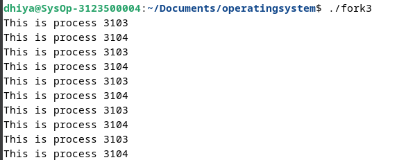

<div align="center">
  <h1 style="text-align: center;font-weight: bold">UTS<br>Praktek Sistem Operasi</h1>
  <h4 style="text-align: center;">Dosen Pengampu : Dr. Ferry Astika Saputra, S.T., M.Sc.</h4>
</div>
<br />
<div align="center">
  
  <h3 style="text-align: center;">Disusun Oleh : </h3>
  <p style="text-align: center;">
    <strong>Fauzan Abderrasheed (3123500020) </strong><br>
    <strong>Muhammad Rafi Dhiyaulhaq (3123500004) </strong><br>
    <strong>Arva Zaki Fanadzan (3123500014)</strong>
  </p>
<h3 style="text-align: center;line-height: 1.5">Politeknik Elektronika Negeri Surabaya<br>Departemen Teknik Informatika Dan Komputer<br>Program Studi Teknik Informatika<br>2023/2024</h3>
  <hr><hr>
</div>


<h1 style="text-align: center;font-weight: bold">UTS Praktek Sistem Operasi</h1>

## Fork : Parent - Child Process

## Soal

1. Buat tulisan tentang konsep fork dan implementasinya dengan menggunakan bahasa pemrograman C! (minimal 2 paragraf disertai dengan gambar)

2. Deskripsikan dan visualisasikan pohon proses hasil eksekusi dari kode program `fork01.c`, `fork02.c`, `fork03.c`, `fork04.c`, `fork05.c` dan `fork06.c`.

3. Buatlah program perkalian 2 matriks [4 x 4] dalam bahasa C yang memanfaatkan `fork()`.

## Jawaban

### 1. Konsep fork dan implementasinya

_Konsep fork_

Konsep fork adalah salah satu konsep penting dalam sistem operasi Unix dan turunannya. Fork membuat proses baru dengan menduplikasi proses pemanggilan (The calling process). Proses baru ini disebut sebagai proses *child* (child process) **dan proses pemanggilan disebut dengan proses *parent* (parent process). Meskipun proses CHILD identik dengan proses PARENT-nya, namun keduanya memiliki PID yang berbeda.

Proses child dan proses parent berjalan di ruang memori terpisah. Pada saat fork(), kedua ruang memori memiliki konten yang sama. Penulisan memori, pemetaan file (mmap(2) ), dan penghapusan pemetaan (munmap(2) ) yang dilakukan oleh salah satu proses tidak mempengaruhi proses lainnya.

Setelah proses baru (CHILD) berhasil dibuat, eksekusi dilanjutkan secara normal di masing-masing proses pada baris setelah panggilan sistem fork(). Proses pemanggil (PARENT) dapat melakukan forking proses lebih dari satu kali, sehingga memungkinkan terdapat banyak proses CHILD yang dieksekusi. Selain itu, proses CHILD juga dapat melakukan forking proses seperti halnya PARENT, sehingga terbentuk struktur pohon proses yang kompleks.

Penting untuk diingat bahwa setelah fork, kedua proses (parent dan child) berjalan secara independen. Seiring berjalannya waktu, kedua proses dapat berinteraksi satu sama lain melalui mekanisme komunikasi seperti pipe, shared memory, atau socket.

proses child merupakan duplikat persis dari proses induk kecuali untuk beberapa poin berikut:

- child punya process ID uniknya sendiri, dan PID ini tidak cocok dengan ID grup proses mana pun yang ada (setpgid(2)) atau sesi.
- Child’s parent process ID sama dengan parent’s process ID
- Child tidak mewarisi parent memory key (mlock(2), mlockall(2))
- dsb


*Implementasi*

Contoh Implementasi menggunakan bahasa C : 

```
#include <stdio.h> 
#include <unistd.h> 

int main() { 
	int i; 

	for (i = 0; i < 3; i++) { 
		pid_t child_pid = fork(); 

		if (child_pid == 0) { 
			printf("Child process %d: PID=%d\n", i + 1, getpid()); 
			break; // Each child process should exit the loop 
		} else if (child_pid < 0) { 
			perror("Fork failed"); 
		} 
	} 

	if (getpid() != 1) { 
		// This code is executed only by the parent process 
		printf("Parent process: PID=%d\n", getpid()); 
	} 

	return 0; 
} 

```

Output: 


### 2. `fork01.c`

Kode Program: 


Output Program: 


Visualisasi:

```
int main() { 
    for(int i = 0; i < 3; i++) {

                    pid: 3056, ppid: 3027, uid: 1000
                            [Main Process]
                                    |
                                 sleep(3)
                                    |
                    pid: 3056, ppid: 3027, uid: 1000
                            [Main Process]
                                    |
                                 sleep(3)
                                    |
                    pid: 3056, ppid: 3027, uid: 1000
                            [Main Process]
                                    |
                                 sleep(3)

    }
  return 0;
}
```

Analisa:
Program ini mencetak ID proses (PID), ID proses parent (PPID), dan ID pengguna (UID) dari proses tersebut. Setelah mencetak informasi tersebut, program akan berhenti selama tiga detik sebelum mencetak informasi lagi. Program ini berulang tiga kali.

### 3. `fork02.c`

Kode Program: 


Output Program: 


Visualisasi:

```
int main() { 
  fork();              > Child process created <
                                 +
                               /   \
    while(1) {                /     \
               pid: 2824, ppid: -    pid: 2825, ppid: 2824
            [Parent Process] x = 5    [Child Process] x = 5
                              \     /
                               \   /
                                 |
                              sleep(2)
                                 |
                                x++
    }
  return 0;
}
```

Analisa:
Program mencetak ID proses (PID) dan nilai variabel x dalam loop tak terbatas.
Program menggunakan systemCall fork() untuk membuat salinan proses saat ini,dan menciptakan child proses.
Kedua proses (parent dan child) akan mencetak informasi PID mereka sendiri dan nilai variabel x.
Program akan terus berjalan dalam loop tak terbatas, dan nilai variabel x akan terus diperbarui dengan penambahan satu setiap dua detik.

### 4. `fork03.c`

Kode Program: 


Output Program: 



Visualisasi:

```
int main() { 
  fork();              > Child process created <
                                 +
                               /   \
    loop 0 to 5 {             /     \
               pid: 3103, ppid: -    pid: 3104, ppid: 3103
               [Parent Process]     [Child Process]
                              \     /
                               \   /
                                 |
                              sleep(2)
                                 |
                                x++
    }
  return 0;
}
```

Analisa:

Panggilan sistem fork() digunakan untuk membuat proses baru yang merupakan replika dari proses pemanggilan. Nilai kembalian dari fork() berbeda untuk proses parent dan proses child:

Dalam proses parent, fork() mengembalikan ID proses child.
Dalam proses child, fork() mengembalikan 0.
Ada loop yang diulang 5 kali. Di dalam loop, program memanggil getpid() untuk mendapatkan ID proses dan mencetak "this is process" diikuti dengan ID proses menggunakan cout. Panggilan sistem sleep(2) menjeda proses selama 2 detik.

Ketika program dijalankan, ia menciptakan proses child menggunakan fork(). Proses parent dan child terus mengeksekusi kode setelah fork(). Karena kedua proses memiliki kode yang sama, keduanya mencetak pesan "this is process" diikuti dengan ID prosesnya.

ID proses parent adalah 3103 dan ID proses child adalah 3104. Outputnya adalah:

this is process 3103
this is process 3104

this is process 3103 // Proses child terus mengeksekusi perulangan
this is process 3104 // Proses parent terus mengeksekusi perulangan

### 5. `fork04.c`

Kode Program: 


Output Program: 


Visualisasi:

```
int main() { 
  fork();              > Child process created <
                                 +
                               /   \
                              /     \
               pid: 3004, ppid: -    \
                [Parent Process]      \  
                        |              \
                        |               \
                       wait          pid: 3005, ppid: 3004
                           \             [Child Process]
                            \         /
                             \       /
                              \     /
                               \   /
                                 |
                                exit
    
  return 0;
}
```

Analisa: 
Program diatas adalah program implementasi dari fork() didalam bahasa C++ dimana ada 2 proses yang memiliki hubungan parent dan child. proses pertama memiliki PID: 3004 dan PPID yang tidak diketahui yang merupakan proses utama (main program atau parent). Setelah program menjalankan fungsi fork() maka akan tercipta proses baru yaitu child dengan PID: 3005 dan PPID: 3004 (PID dari proses utama (parent)). Setelah parent program memberikan output yang menyebutkan nomor PID nya dan nomor PID dari child, parent program akan melakukan tahap menunggu (wait) untuk menunggu child program berjalan. Child program berjalan dan memberikan output nomor PID nya dan nomor PPID nya, lalu akan langsung exit the process. Setelah child program exit the process maka parent program akan mengikuti untuk exit the process juga. Dan ini adalah end of program.


### 6. `fork05.c`

Kode Program: 


Output Program: 


Visualisasi:

```
int main() { 
  fork();              > Child process created <
                                 +
                               /   \
                              /     \
               pid: 3017, ppid: -    \
                [Parent Process]      \  
                        |              \
                        |               \
                        |          pid: 3018, ppid: 3017
                       wait           total 4
                          \           execl(/bin/ls) 
                           \         [Child Process]
                            \         /
                             \       /
                              \     /
                               \   /
                                 |
                                exit
    
  return 0;
}
```

Analisa:
Program diatas adalah program implementasi dari fork() didalam bahasa C++ dimana ada 2 proses yang memiliki hubungan parent dan child. proses pertama memiliki PID: 3017 dan PPID yang tidak diketahui yang merupakan proses utama (main program atau parent). Setelah program menjalankan fungsi fork() maka akan tercipta proses baru yaitu child dengan PID: 3018 dan PPID: 3017 (PID dari proses utama (parent)). Setelah parent program memberikan output yang menyebutkan nomor PID nya dan nomor PID dari child, parent program akan melakukan tahap menunggu (wait) untuk menunggu child program berjalan. Child program akan berjalan dan memberikan output nomor PID nya dan nomor PPID nya dan menjalankan program `execl("/bin/ls", "ls", "-l", "/home", NULL)`, `total 20` disini adalah jika proses child berhasil menjalankan sistem panggilan `execl()`, maka hasil dari perintah `ls -l /home` akan dicetak, serta setiap proses mencetak pesan sebelum mengakhiri eksekusi. Jadi, total output yang dihasilkan adalah 4. Setelah output dari program child diberikan, program child akan langsung exit the process. Setelah child program exit the process maka parent program akan mengikuti untuk exit the process juga. Dan ini adalah end of program.


### 7. `fork06.c`

Kode Program: 


Output Program: 


Visualisasi:

```
int main() { 
  fork();              > Child process created <
                                 +
                               /   \
                              /     \
               pid: 3038, ppid: -    \
                [Parent Process]      \  
                        |              \
                        |               \
                        |          pid: 3039, ppid: 3038
                       wait           execl(fork3) 
                          \           [Child Process]
                           \           /
                            \         /
                             \       /
                              \     /
                               \   /
                                 |
                                exit
    
  return 0;
}
```

Analisa:
Program diatas adalah program implementasi dari fork() didalam bahasa C++ dimana ada 2 proses yang memiliki hubungan parent dan child. proses pertama memiliki PID: 3038 dan PPID yang tidak diketahui yang merupakan proses utama (main program atau parent). Setelah program menjalankan fungsi fork() maka akan tercipta proses baru yaitu child dengan PID: 3039 dan PPID: 3038 (PID dari proses utama (parent)). Setelah parent program memberikan output yang menyebutkan nomor PID nya dan nomor PID dari child, parent program akan melakukan tahap menunggu (wait) untuk menunggu child program berjalan. Child program akan berjalan dan memberikan output nomor PID nya dan nomor PPID nya dan menjalankan program `execl(fork3)`, panggilan sistem `execl()` digunakan untuk menjalankan sebuah program di dalam proses yang sudah ada, pada program yang ini sistem `execl()` menjalankan program fork3 pada file fork3.cpp. Setelah output dari program child diberikan, program child akan langsung exit the process. Setelah child program exit the process maka parent program akan mengikuti untuk exit the process juga. Dan ini adalah end of program.

.

### 8. Tugas Perkalian Matriks

```
#include <stdio.h>
#include <stdlib.h>
#include <unistd.h>
#include <sys/wait.h>

#define ROWS 4
#define COLS 4

void printMatrix(int matrix[ROWS][COLS]) {
    for (int i = 0; i < ROWS; i++) {
        for (int j = 0; j < COLS; j++) {
            printf("%d ", matrix[i][j]);
        }
        printf("\n");
    }
}

int main() {
    int matrix[ROWS][COLS];
    int skalar = 2;

    for (int i = 0; i < ROWS; i++) {
        for (int j = 0; j < COLS; j++) {
            matrix[i][j] = i * j;
        }
    }

    printf("Matriks Awal:\n");
    printMatrix(matrix);

    pid_t pid = fork();

    if (pid == 0) {
        printf("\nProses Anak - Matriks Hasil:\n");
        for (int i = 0; i < ROWS; i++) {
            for (int j = 0; j < COLS; j++) {
                matrix[i][j] *= skalar;
                printf("%d ", matrix[i][j]);
            }
            printf("\n");
        }
    } else if (pid > 0) {
        wait(NULL);
        printf("\nProses Induk Selesai.\n");
    } else {
        fprintf(stderr, "Fork gagal.\n");
        return 1;
    }

    return 0;
}
```

Output


Analisa:
Kode di atas adalah program perkalian dua matriks [4 x 4] dalam bahasa C yang menggunakan fork().

Proses Fork: Setelah matriks diinisialisasi, program melakukan fork untuk menciptakan proses child. Proses child akan mengalikan setiap elemen matriks dengan skalar, sementara proses parent menunggu proses child selesai.

Pemrosesan Serial: Meskipun perkalian skalar dilakukan secara paralel oleh proses child, program menunggu proses child selesai sebelum melanjutkan eksekusi. Ini dilakukan dengan menggunakan fungsi wait(), sehingga proses parent akan menunggu sampai proses child selesai sebelum mencetak pesan bahwa proses parent telah selesai.

Kesimpulannya, program ini memberikan contoh yang baik tentang penggunaan fork dalam bahasa pemrograman C untuk melakukan operasi secara paralel. Dengan memahami konsep fork dan multitasking, programmer dapat membuat aplikasi yang lebih efisien dan responsif.
