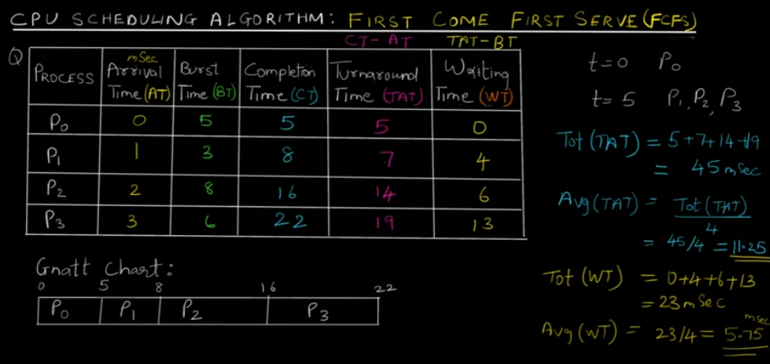
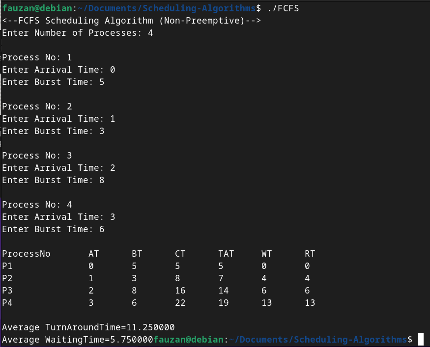
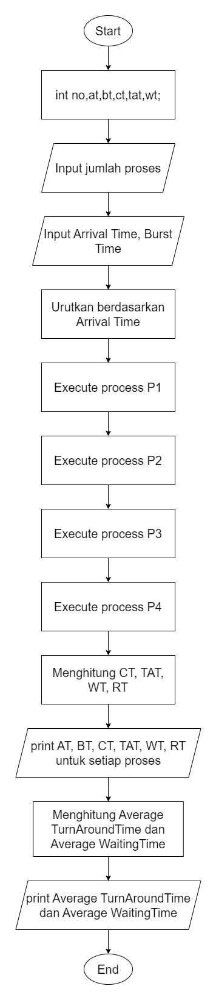
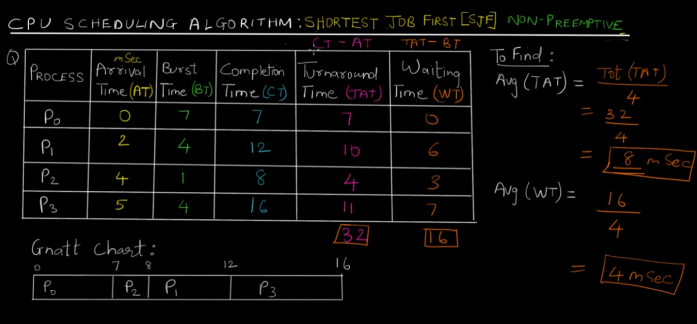
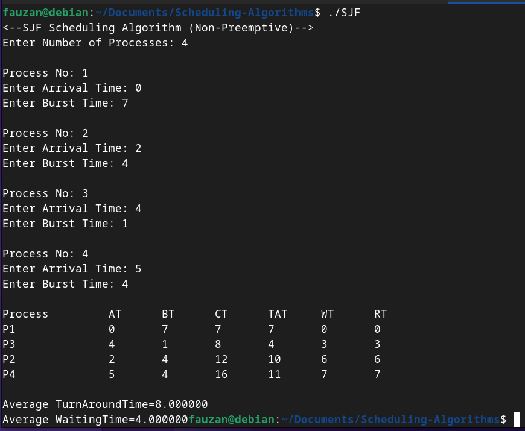
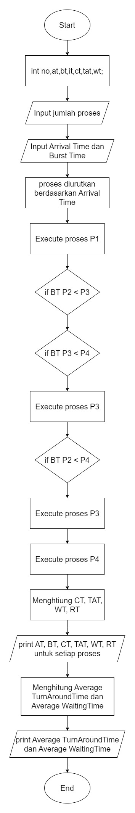
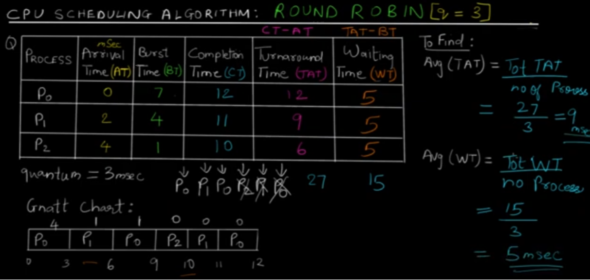
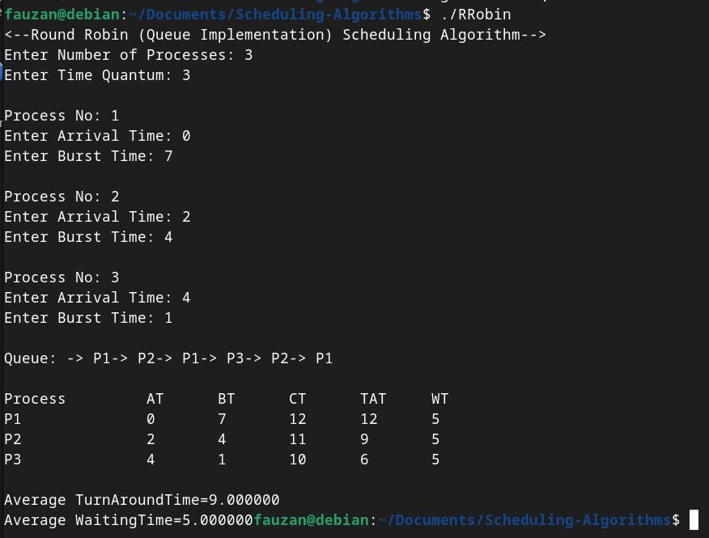

  <h1 style="text-align: center;font-weight: bold">Praktikum 11 Praktek Sistem Operasi</h1>
  <h4 style="text-align: center;">Dosen Pengampu : Dr. Ferry Astika Saputra, S.T., M.Sc.</h4>

 

  
  <h3 style="text-align: center;">Disusun Oleh : </h3>
  

    <strong>Fauzan Abderrasheed (3123500020) </strong> 
    <strong>Muhammad Rafi Dhiyaulhaq (3123500004) </strong> 
    <strong>Arva Zaki Fanadzan (3123500014)</strong>
  

<h3 style="text-align: center;line-height: 1.5">Politeknik Elektronika Negeri Surabaya Departemen Teknik Informatika Dan Komputer Program Studi Teknik Informatika 2023/2024</h3>
  

# Scheduling Algorithm

## First-Come First-Serve Algorithm

### Contoh Perhitungan Proses secara Teori

### Hasil percobaan running program

### Flowchart dari First-Come First-Serve Algorithm

### Analisa

Dari gambar hasil percobaan diatas dapat dianalisa bahwa Algoritma First-Come First-Serve sudah berjalan sesuai teori yang ada. First-Come First-Serve Algorithm berjalan dengan konsep antrian (queue) dimana proses yang pertama datang (arrival time palig awal) akan dijalankan terlebih dahulu, lalu proses selanjutnya yang ada setelah proses yang sudah selesai berjalan, dan seterusnya seperti konsep antrian. Konsep antrian disini adalah dimana yang datang lebih dahulu yang dilayani terlebih dahulu, sehingga proses berjalan berurutan.

---

## Shortest Job First Algorithm

### Contoh Perhitungan Proses secara Teori

### Hasil percobaan running program

### Flowchart dari Shortest Job First Algorithm

### Analisa

Shortest Job First Algorithm berjalan dengan memprioritaskan jumlah burst time yang paling sedikit dan melihat arrival time nya juga. Proses berjalannya adalah proses yang pertama datang akan di execute sampai selesai dahulu, lalu proses yang ada di ready queue akan dibandingkan (compare) manakah yang memiliki burst time yang paling sedikit, yang memiliki burst time paling sedikit inilah yang selanjutnya akan di-execute. Jika ada kondisi dimana suatu proses memiliki burst time yang sama, maka yang didahulukan adalah proses yang arrival timenya lebih kecil (yang datang lebih dulu). 

---

## Round Robin Algorithm

### Contoh Perhitungan Proses secara Teori

### Hasil percobaan running program

### Flowchart dari Round Robin Algorithm

### Analisa

Round Robin Algorithm bekerja dengan memiliki time quantum, yang pada dasarnya time quantum disini merupakan batas waktu sebuah proses untuk dapat berjalan. Jika burst time suatu proses lebih kecil dari Quantum time, maka proses akan dijalankan selama burst time. Jika burst time suatu proses lebih besar dari Quantum time, maka proses akan berjalan selama Quantum time dan burst time dari proses akan di update menjadi sisa burst time setelah berjalan selama Quantum time (Burst time - Quantum time = Sisa Burst Time) lalu akan dikembalikan ke ready queue. Proses ini berjalan sampai semua proses terselesaikan. Pada percobaan di atas diberikan detail output dari queue bagaimana proses berjalan, dimulai dari P1 -> P2 -> P1 -> P3 -> P2 -> P1. 