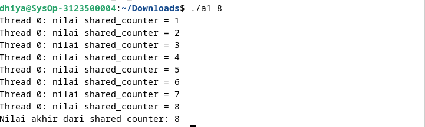
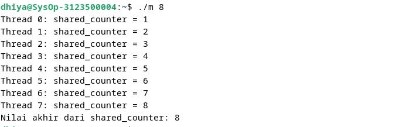

  <h1 style="text-align: center;font-weight: bold">Praktikum 12 Praktek Sistem Operasi</h1>
  <h4 style="text-align: center;">Dosen Pengampu : Dr. Ferry Astika Saputra, S.T., M.Sc.</h4>

 

  
  <h3 style="text-align: center;">Disusun Oleh : </h3>
  

    <strong>Fauzan Abderrasheed (3123500020) </strong> 
    <strong>Muhammad Rafi Dhiyaulhaq (3123500004) </strong> 
    <strong>Arva Zaki Fanadzan (3123500014)</strong>
  

<h3 style="text-align: center;line-height: 1.5">Politeknik Elektronika Negeri Surabaya Departemen Teknik Informatika Dan Komputer Program Studi Teknik Informatika 2023/2024</h3>
  

# Mutex (Analisa Soal 2)

## Program Tanpa Mutex

### Output

### Analisa

Program ini menggunakan thread untuk memodifikasi variabel global `shared_counter` secara paralel, namun tidak menggunakan mekanisme penguncian seperti `mutex`, sehingga berpotensi menghadapi kondisi balapan (race condition). Dalam program ini, setiap thread menambah nilai `shared_counter` dan mencetak nilai saat ini tanpa memastikan bahwa akses ke variabel tersebut dilakukan secara eksklusif. Akibatnya, beberapa thread bisa mengakses dan mengubah `shared_counter` pada saat yang sama, yang dapat menyebabkan hasil yang tidak konsisten atau salah. Kesimpulannya, program ini mengilustrasikan pentingnya penggunaan mekanisme penguncian dalam pemrograman multithreaded untuk menjaga integritas data dan menghindari konflik akses yang dapat mengakibatkan hasil yang tidak diinginkan.

## Program Dengan Mutex

### Output 

### Analisa

Program ini menunjukkan penggunaan dasar thread dan mutex dalam pemrograman C untuk mengelola akses ke variabel bersama secara aman. Dengan memanfaatkan thread, program dapat menjalankan beberapa tugas secara paralel, dalam hal ini menambah nilai `shared_counter`. Untuk mencegah kondisi balapan, program menggunakan mutex sehingga hanya satu thread yang dapat mengakses dan memodifikasi `shared_counter` pada satu waktu. Setelah semua thread selesai, program mencetak nilai akhir `shared_counter`. Ini membantu memahami pentingnya mekanisme penguncian dalam menjaga konsistensi data dalam lingkungan multithreaded, memastikan tidak ada konflik akses yang dapat menghasilkan nilai yang salah atau tidak diinginkan.
